<h1>Easy Builder Tutorial em português</h1>

# Table Content
- [First steps in Easy Builder 🦶](#id-frist)
- [It's time to get hands-on 🖐️](#id-hands)
- [Components 🧱](#id-component)
    - [Textfield 📓](#id-textfield)
    - [TextArea 📄](#id-textarea)
    - [Editor 🎬](#id-Editor)
    - [Hidden 🙈](#id-Hidden)
    - [Integer 🔢](#id-Integer)
    - [Decimal 💲](#id-Decimal)
    - [ProgressBar 📶](#id-ProgressBar)
    - [Gantt 📊📅](#id-Gantt)
    - [Date 📆](#id-Date)
    - [DateTime 📆⏲️](#id-DateTime)
    - [Time ⌛](#id-Time)
    - [Checkbox ✅](#id-CheckBox)
    - [ChecklistDB 📁](#id-ChecklistDB)
    - [Radio 🔘](#id-Radio)
    - [Dropdown🗄️](#id-Dropdown)
    - [DropdownDB 📥](#id-DropdownDB)
    - [AutoComplete 🗄️🧲](#id-AutoComplete)
    - [Label 🔤](#id-Label)
    - [Wizard 🛤️](#id-Wizard)
    - [Box 📦](#id-Box)
    - [Signature ✒️](#id-Signature)
    - [Static Image 🌄](#id-Static)
    - [Upload Image 📸📩](#id-Upload)
    - [File Upload 📂📩](#id-File)
    - [One-To-Many 📃➡️📃](#id-One-To-Many)
    - [Multi Upload 📂➕](#id-MultiUpload)
    - [Multi-tag 🏷️](#id-MultiTag)
    - [Additional Data ➡️📃](#id-Additional)
    - [Button ⏸️](#id-Button)
    - [HTML Field 🦰](#id-HTML)
    - [Quiz 🧩](#id-Quiz)
    - [Email 📧](#id-Email)
    - [Password 🔐](#id-Password)
    - [Horizontal Line 📏🪓](#id-Horizontal)
    - [Repeater 🔁](#id-Repeater)
    - [Page View 🖼️](#id-PageView)
    - [Chat 💬](#id-Chat)
    - [Location 🗺️](#id-Location)
    - [Chart 📊](#id-Chart)
    - [Multi-Select 🌐](#id-Multi-Select)
    - [Grid 🗃️](#id-Grid)
    - [Carousel 🎠](#id-Carousel)
- [Form 📄](#id-form)
    - [Video call Coming Soon](id-Video)
    - [Tab (Form)](#id-Tab)
    - [Dev Properties (Form)](#id-Properties)
    - [CSS Class (Dev Properties)](#id-CSS)
    - [Notification (Form)](#id-Notification)
    - [Event type](#id-Event)
    - [Software Replication](#id-Software)
    - [List](#id-list)
    - [How to Add a User](#id-How)
    - [How to Give User Permission](#id-Permission)
    - [Form Events](#id-Form-Events)
- [Tools 🔧](#id-Tools)
    - [🔧 DataSource](#id-DataSource)
    - [🔧 Process](#id-Process)
    - [🔧 Process Job](#id-Job)
    - [🔧 Report](#id-Report)
    - [🔧 API](#id-API)
    - [🔧 Template](#id-Template)
    - [🔧 Scheduler](#id-Scheduler)
    - [🔧 Notification](#id-2Notification)
- [Project Settings 🧰](#id-ProjectSettings)
    - [🧰 Main](#id-Main)
    - [🧰 Project Configurations](#id-ProjectConfigurations)
    - [🧰 Database Configurations](#id-DatabaseConfigurations)
    - [🧰 Menus](#id-2Menus)
    - [🧰 DataBase Manager](#id-DataBaseManager)
    - [🧰 Editors](#id-Editors)
    - [🧰 Email](#id-2Email)
    - [🧰 Images](#id-2Images)
 - [Builder Apis ☁️](#id-apis)
   - [☁️ Authentication](#id-authentication) 
   - [☁️ Paginate](#id-paginate)
   - [☁️ Get](#id-get)
   - [☁️ Save](#id-save)
   - [☁️ Delete](#id-delete)
- [Page Tutorials 📄](#id-PageTutorials)
   - [Criar gride em uma page](#id-gridInPage)
   - [Como filtrar um DropdownDB por outro DropdownDB](#id-FiltroDDB)

   teste sa saq

## Primeiros passos no Easy Builder 🦶

Em primeiro plano precisamos criar um login no <b>"Easy Builder"(nossa plataforma de criação).

    
- Acessando o link https://builder.easy.rocks/

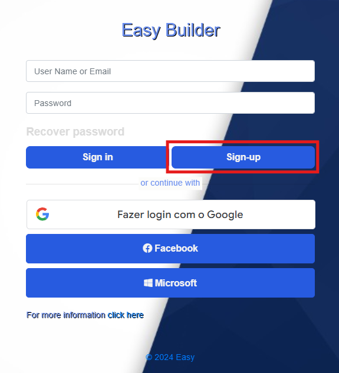   
    
 Nesta imagem vemos uma tela de login, é nela que você ira se cadastrar, há varias formas de cadastro como Google, Microsoft Teams,Facebook ou com seu email,o recomendado é que utilize o email da Easy (....@easyteam.rocks) o qual você recebeu clicando em <i>"Sign UP". 
  
### Agora precisamos confirmar seu email 📧⚠️
Será enviado um link de confirmação para o seu email cadastrado, então acesse-o, e abra o email da Easy Builder que será encontrado na Caixa de Entrada ou no Lixo Eletrônico.

 

Por fim clique em _Link Here_  para confirmar o email.⤴️

Pronto agora você ja pode logar no <b>"Easy Builder"</b> sem problemas clicando em _Sign In_.⤵️
 
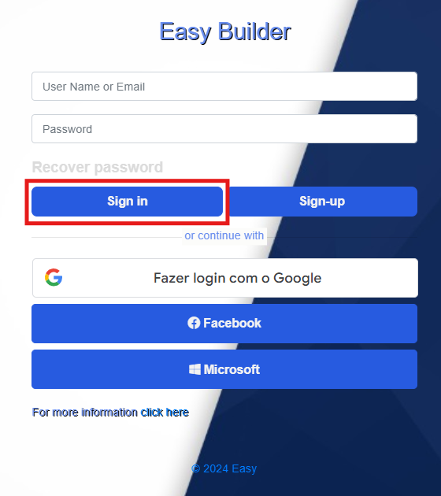

                                                                   Feito o cadastro Parabens!!🥇🎉

 
## É hora de por a mão na massa 🖐️

Agora iremos aprender a fazer um projeto, menu e formulário básico, para que você já possa experimentar as funcionalidades do Easy Builder.

Após o login no Builder você irá se deparar com o seguinte contéudo:

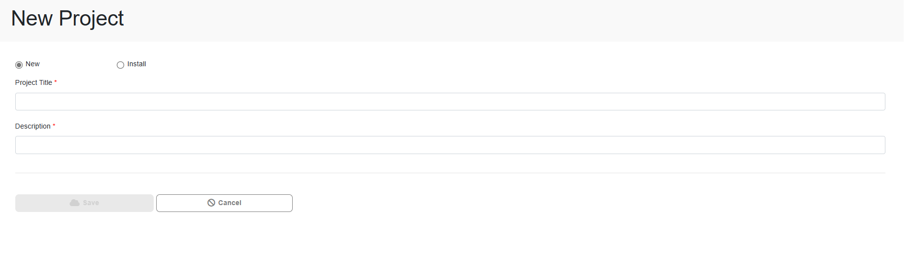

    
Selecione “New” e logo abaixo em “Project title” escreva o título do seu projeto (pode ser “ProjetoTeste”) e um descricrição do projeto(pode ser "Projeto teste para tutorial")

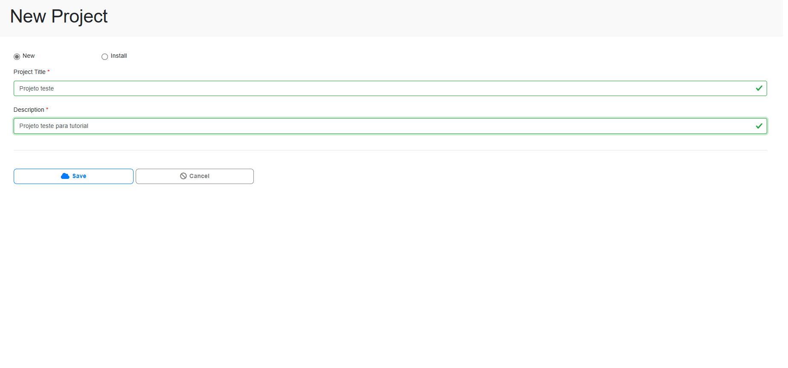

e clique no botão _Save_

(Irá demorar um pouco aqui pois estará sendo criado o banco de dados para o seu projeto)

Agora você estará na sua página inicial com as três abas principais, nesse caso automaticamente será a aba “Project”. 

Então, voltará na tela inicial com as duas abas principais “Form” e “Report” (que significa “Formulário” e “Relatório” respectivamente), agora clique na aba “Form” que esta marcada em verde:
    
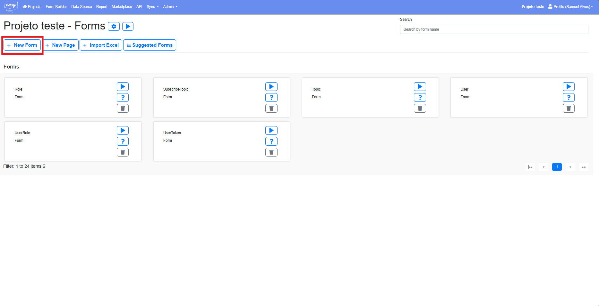
    
E agora clique no botão _Form_, que está marcado em vermelho na imagem acima, automaticamente irá abrir uma nova aba no seu navegador.
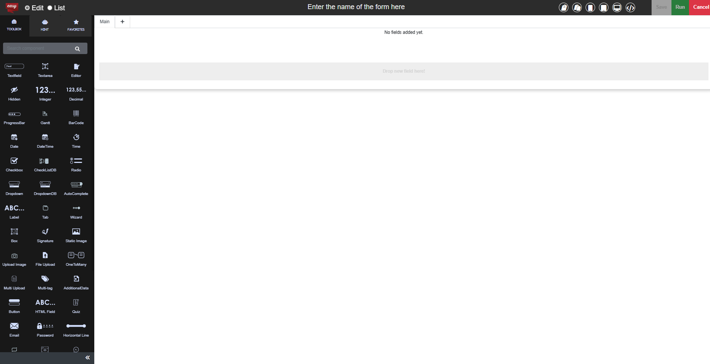

Nessa nova página, no campo do “Enter the name of the form here” escreva o título do seu formulário (pode ser “FormulárioTeste”).

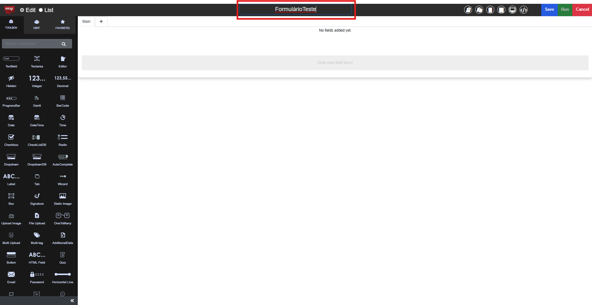

Clique no botão _"Save"_ que se encontra na parte superior a direita.

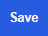

Selecione o componente “Textfield” (da aba lateral Tools - Gallery Fields) e arraste para o campo cinza onde está escrito “Drop new field here!”.

Agora clique no componente que você arrastou (“Textfield”), e logo irá abrir uma aba lateral na direita chamada “Properties of Field”.

Lá no topo do “Properties of Field”, abaixo de “General”, No campo “Name”  escreva ‘‘Nome’’ e no campo “Label” também escreva “Nome”.
Agora clique no botão  _"Save"_ e depois clique no botão _"Run"_, irá abrir a seguinte página:

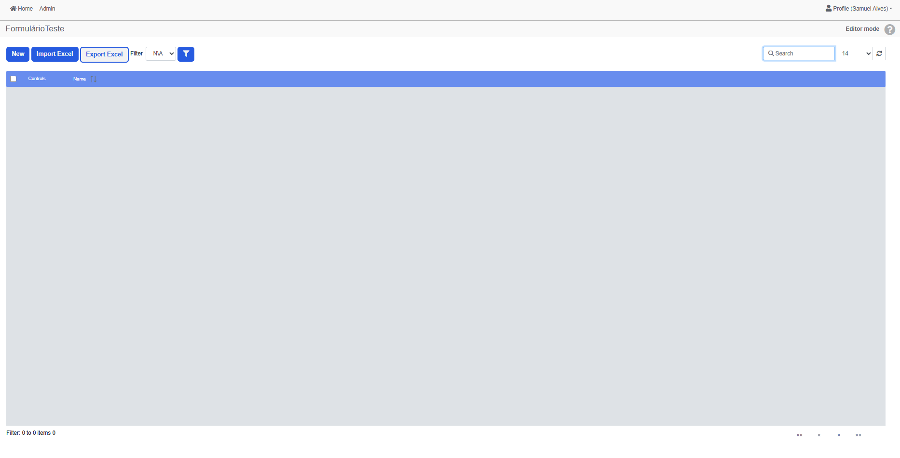

Aqui estará disponível a visualização dos registros salvos. ⤴️
    
> Clique no botão _"New"_, você será direcionado para a seguinte tela:

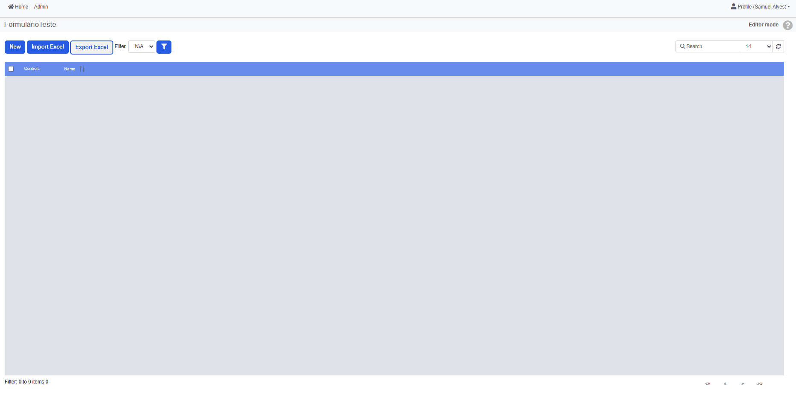

Adicione o nome “Samuel”, e clique no botão _"Save & Close"_ !!

 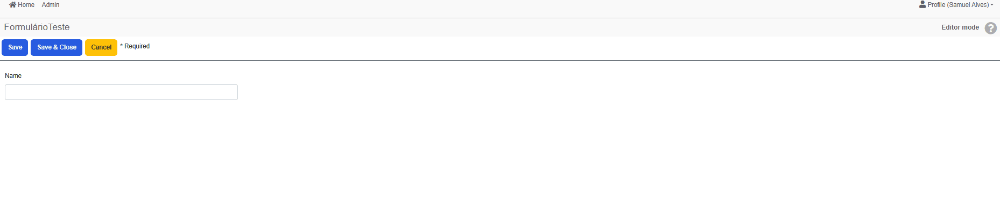

<h3>⚠️Atenção para não confundir "Save" em vez de "Save & Close"</h3>

Repita o processo colocando nome diferente.

Você pode fazer o download da lista de registros em formato de  lista do excel clicando no botão _"Export Excel"_ 
    
e então será enviado no seu email o link para download da lista excel.
Um gif curto para te ajudar:

### Como Executar a Aplicação 💻

Ao chegar na tela do formulário, preencha o “Form Title”(o titulo do formulário) e insira os componentes “Textfield” e “Email”:

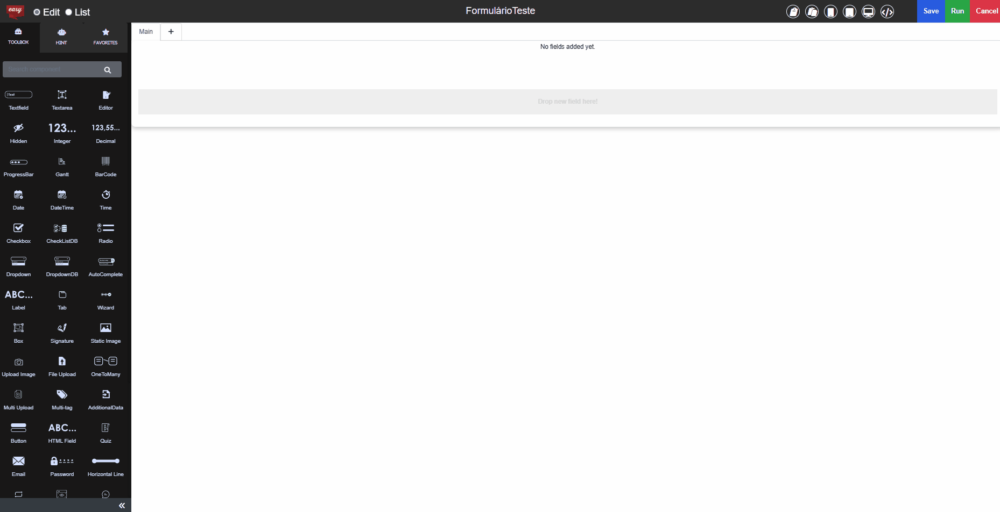

Já podemos executar a aplicação, para isso, clique no botão _"SAVE"_ no pé da página e depois clique no botão _"Run"_

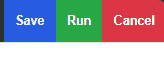

 Irá para a seguinte tela

Essa é a tela dos registros após eles terem sido inseridos e salvos.⤴️

Para inserir novos registros, clique no botão _"New"_ no topo desta tela

Então irá abrir a seguinte tela:

Essa é a tela de registrar, onde irá inserir as novas informações dentro do sistema.

Após preencher os campos, clique no botão _"Save & Close".

E você estará de volta na tela dos registros, com o formulário salvo e disponível para visualização.
*Caso queira editar o formulário salvo, clique no 
(Embaixo da coluna do “Control”)

## AVISOS⚠️

Na maioria dos componentes, não estará sendo mostrado as seções do “Properties of Field” (General, Values, Behavior, Presentation, Intro, Others) para evitar repetição de conteúdo. 

Logo, para aprender como utilizar essas seções acima mencionadas, acesse o tutorial do componente “Textfield”, pois nele estará sendo explicado com detalhes cada seção.

Entretanto, terá componentes mostrando as seções, pois terão itens e seções diferentes do componente “Textfield”.

Para aprender como usar a seção “Events”, vá até os tutoriais dos componentes “Decimal” e “Button”.

Sempre verifique se há continuação de conteúdo na próxima página, as vezes não coube a imagem na mesma página.

Para realizar os tutoriais de “Static Image”, “Upload Image”, e “File Upload” é necessário ter armazenamento (Blob Container).

Se tiver qualquer dúvida, entre em contato com o suporte da Easy Comtec.

 
## COMPONENTES 🧱
São 30 componentes que iremos aprender a utilizar, são eles:
<table>
 <tr>
  <td>Textfield</td>
  <td>TextArea</td>
  <td>Editor</td>
  <td>Hidden</td>
  <td>Integer</td>
  <td>Decimal</td>
  <td>Date</th>
  <td>DateTime</td>
  <td>Time</th>
 </tr>
 <tr>
  <td>Checkbox</td>
  <td>ChecklistDB</td>
  <td>Radio</td>
  <td>Dropdown</td>
  <td>DropdownDB</td>
  <td>AutoComplete</td>
  <td>Label</td>
  <td>Box</td>
  <td>Signature</td>
 </tr>
 <tr>
  <td>Static Image</td>
  <td>Upload Image</td>
  <td>File Upload</td>
  <td>One-To-Many</td>
  <td>Multitag</td>
  <td>Additional Data</td>
  <td>Button</td>
  <td>HTML FIeld</td>
  <td>Quiz</td>
 </tr>
 <tr>
  <td>Email</td>
  <td>Password</td>
  <td>Horizontal Line</td>
 </tr>
</table>

É importante perceber que na seção “Properties of Field”, existem várias seções (“General”, “Behavior”, “Presentation”, “Events”, “Intro”, etc) podendo ter mais ou menos seções, e com mais ou menos itens, dependendo do componente. 

O exemplo de “Properties of Field” da imagem abaixo é do componente “Textfield”.

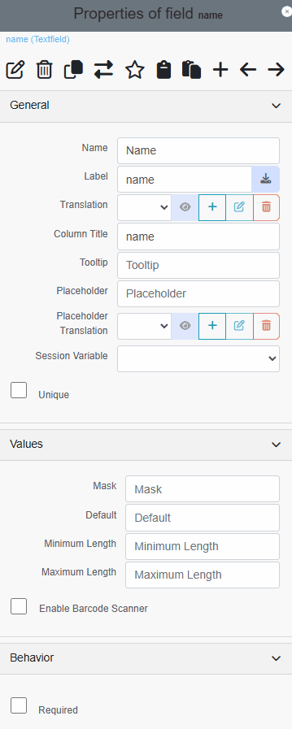

É importante saber disso para que facilite o processo de localizar as seções, itens, etc. 

Outra situação recorrente é a referenciação dentro do tutorial de um componente para outro tutorial dentro deste documento. 

É importante também que já tenha realizado os passos dos tutoriais  “Como Criar Seu Primeiro Projeto, Menu e Formulário” e “Como Executar a Aplicação”.

 
## Textfield 📓

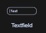

O componente “Textfield” serve para escrever textos, principalmente nomes, mas também pode ser utilizado para gravar números de telefone usando a máscara nas propriedades do campo, veremos como fazer isso em breve.

Selecione o componente “Textfield”, então arraste-o e solte-o onde está escrito “Drop new field here!”. Quando soltá-lo, irá aparecer do lado direito da tela uma aba chamada “Properties of Field” (Se não aparecer, apenas clique no componente que você acabou de soltar).
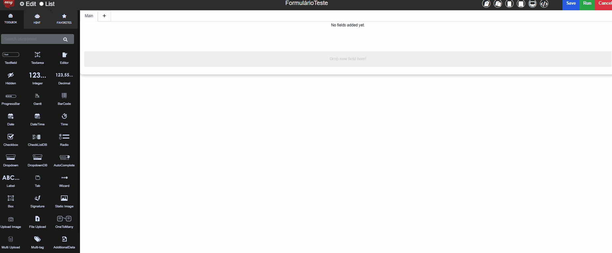

🔗Vídeo:https://www.youtube.com/watch?v=ySN4K9JrlwQ&list=PLTHIfO0UrihGXWtezzJnmZgS74lfA3PdH&index=11

### Textfield 📓 > GENERAL 🎖️

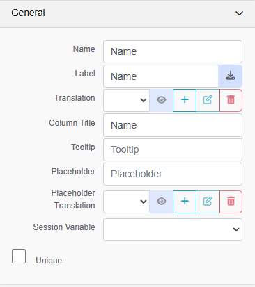

Nessa aba “Properties of Field”, abaixo de “General”, tem o campo “Name”, este se refere a identificação do campo para a codificação, para possíveis programações posteriores. Geralmente nele você irá repetir o que estará escrito em “Label” que é a identificação do campo para o usuário.

O campo “Column Title” serve para identificar quando for visualizar a lista (para visualizar em formato lista observe o topo da página, selecione “List” ).

O campo “Placeholder” serve como um guia para o que preencher, é interessante que você visualize isso, escreva no campo “Testando”, observe o efeito no campo no formulário.

### Textfield 📓 > VALUES 1️⃣

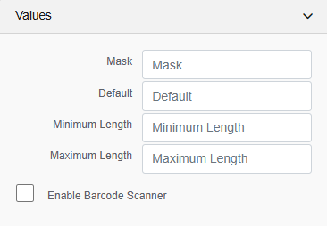

Em “Properties of Field”, abaixo de “Values”, há 4 campos e uma caixa de seleção, que são respectivamente: “Mask”, “Default”, “Minimum Length”, “Maximum Length” e “Enable Barcode Scanner”.

Em “Mask” você pode determinar o padrão específico de preenchimento, ou seja, quantidade e tipo específica de caracteres. Por exemplo, se você quer que o campo aceite números de telefone em um formato específico, você pode preencher esse campo com (00)00000-0000, faça isso agora para testarmos.

Para que fique harmônico, vá em “Name” e “Label” e escreva “Número de Telefone”. Deixe o campo do “Placeholder” em branco.

Execute a aplicação.
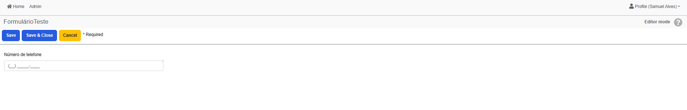

Preencha o campo “Número de telefone” com qualquer número, pode ser (45) 98765-4321 
e  então clique no botão 

Agora você consegue visualizar seus registros:
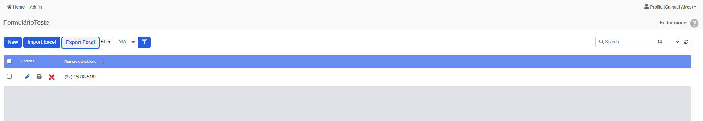
 e o processo é o mesmo de antes para adicionar novos registros.

“Default” se refere a um preenchimento automático de valor. Insira no campo “Default” do “Número de Telefone” com “(45)99887-6655”.

Execute a aplicação.

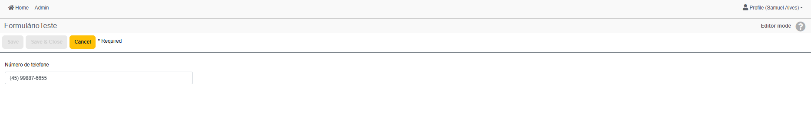

Observe que já está preenchido com (45)99887-6655, mas é possível alterá-lo.

“Minimum Length” se refere ao número mínimo de caracteres a ser usado no preenchimento do campo. Por exemplo, selecione e arraste mais um componente “Textfield” para dentro do formulário e então edite apenas essa configuração do “Minimum Length” para o valor de 5.

Execute a aplicação. Ao preencher o campo você perceberá que será necessário no mínimo 5 caracteres para que seja possível salvar o registro

“Maximum Length” se refere ao número máximo de caracteres permitido no preenchimento do campo. Por exemplo, você pode selecionar e arrastar mais um “Textfield” para dentro do formulário e então editar apenas essa configuração do “Maximum Length” para o valor de 10.

Execute a aplicação. Ao preencher o campo você perceberá que será permitido no máximo 10 caracteres para que seja possível salvar o registro.

“Enable Barcode Scanner” se refere a permitir scanner de código de barras. Você pode testar essa configuração ao selecionar a caixa de seleção e então execute a aplicação. Na tela de registro, 
clique no  e então irá acionar a câmera do dispositivo, e fará a leitura do código de barras.

### Textfield 📓 > BEHAVIOR 🎬

Aqui você encontrará 3 caixas de seleção (Required, Disabled e Visible) e 3 listas suspensas (Visibility Rules, Required Rules e Disabled Rules).

Traduções: 

Required = Obrigatório
Disabled = Desativado
Visible = Visível

Visibility Rules = Regras de Visibilidade 
Required Rules = Regras de Obrigatoriedade 
Disabled Rules = Regras de Desativação

Por padrão, as caixas de seleção “Required” e “Visible” estarão marcadas e a caixa “Disabled” estará desmarcado.

Você pode alterar de obrigatório para opcional, visível para invisível e desativado para ativado, basta marcar ou desmarcar a caixa de seleção.

Referente às regras de visibilidade, obrigatoriedade e desativabilidade, é importante destacar que elas são dependentes de outro campo dentro do formulário.

Vamos testar isso na prática. Selecione e arraste o componente “Integer” para dentro do formulário.

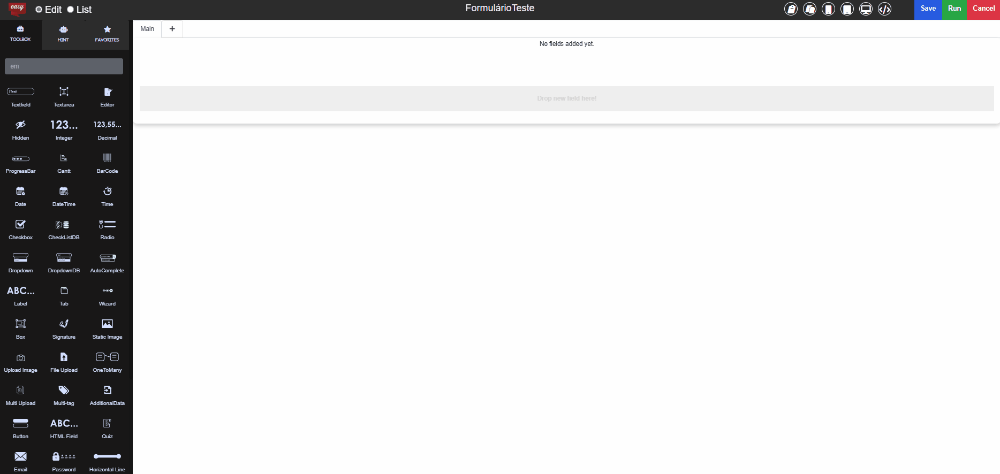

 no “Properties of Field”, abaixo de “General”, em “Name” e “Label” preencha o campo com “Idade”. 
 
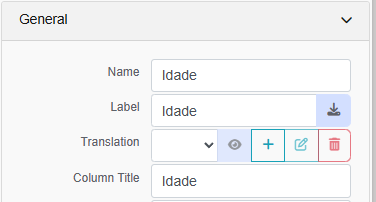

Volte a editar as propriedades de  “Idade” abaixo de “Behavior” ,clique no 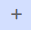
do “Visibility Rules”,

irá abrir a seguinte janela:

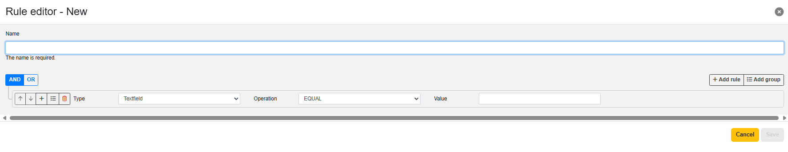

no “Name” escreva “Regra da Idade”, em “Type” selecione “Integer”, em “Operation” selecione “Greater or Equal”, em “Value” escreva “18”.

Agora clique no botão 

Agora desmarque a caixa de seleção “Visible”.

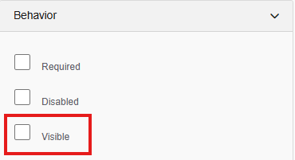

Então clique na lista suspensiva do “Visibility Rules” (do campo “Idade”) e selecione “Regra da Idade”:

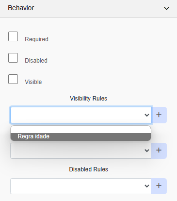

 e então aparecerá mais uma lista embaixo, clique e selecione “Idade”.
(imagem na próxima página)

Agora execute a aplicação .

Automaticamente se abrirá uma nova página no seu navegador (tela dos registros), clique no botão 

Preencha o campo “Idade” com “18” e observe que o campo “Número de Telefone” surge para ser preenchido.

e se preencher o campo “Idade” com “17”, o campo “Número de Telefone” não irá aparecer.

Você pode aplicar essas regras da mesma forma para a obrigatoriedade e desativação.

### Textfield 📓 > OTHERS 📝
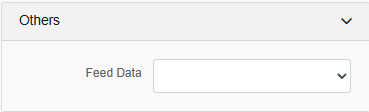

Aqui na seção “Others” você encontrará essa lista do “Feed Data”, que serve para preencher o campo com dados fictícios para validá-lo.

Com o campo “Número de Telefone” ou “Nome Completo” você pode preenchê-lo com a opção “Phone” ou “People” respectivamente.

Agora execute a aplicação.

Automaticamente se abrirá uma nova página no seu navegador, e você verá registro de números de telefones/nomes fictícios na tela (próxima página), que verificará o campo como válido.

### Textfield 📓 > PRESENTATION 📊
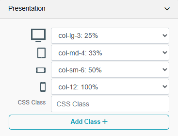

Nessa seção você consegue editar quanto de espaço o campo irá ocupar nas telas de desktops, tablets, mobiles horizontais e mobiles verticais respectivamente. O espaço ocupado pode variar de 8% até 100%.

Clique no campo “Número de Telefone”  criado antes.

Se você está usando desktop, clique na primeira lista suspensiva e então escolha a opção col-lg-12:100% e observe como ficou no formulário.

Execute a aplicação.

Você pode voltar na tela de edição do formulário e testar com as outras medidas para visualizar como ficam.

No item “CSS Class”  você pode informar a classe de css customizada para o componente.

### Textfield 📓 > EVENTS 🎞️
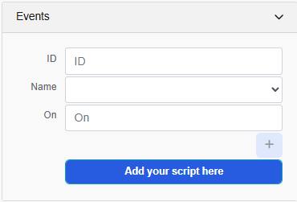

Para saber mais sobre como usar essa funcionalidade, vá até a seção “Events” dos componente “Decimal” e “Button”.

### Textfield 📓 > INTRO ℹ️ 

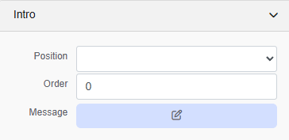

A seção “Intro” serve como uma introdução instrutiva, para explicar sobre o preenchimento dos campos ou o que você achar importante.

É importante saber que essa funcionalidade só irá funcionar na primeira vez, se quiser testá-lo novamente será preciso criar um novo formulário.

Vamos testar isso agora, selecione e solte dois componentes “Textfield” dentro do formulário. 
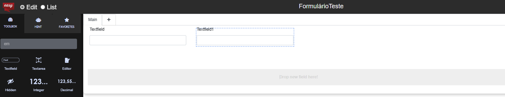

No primeiro “Textfield”, em “Position” selecione “Top”, em “Order” digite “1”, em “Message” escreva “Primeiro esse” (imagem na próxima página).

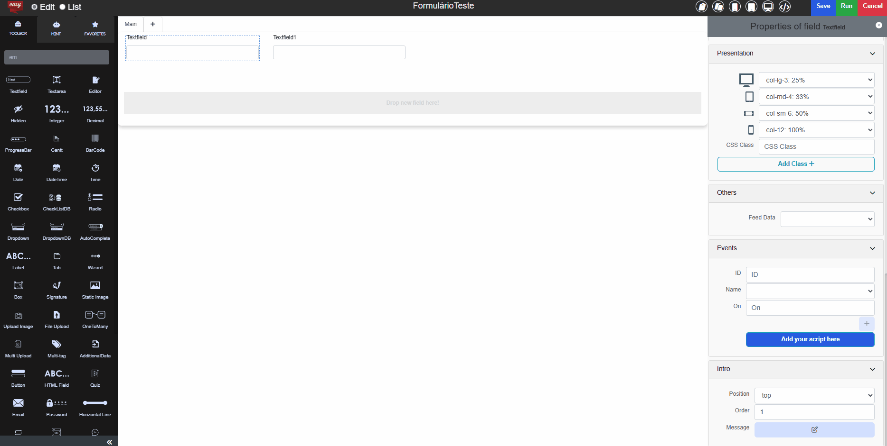

Agora execute a aplicação.
Clique no botão .

Então irá aparecer o efeito do intro na seguinte página:

Essa visualização de destaque do campo com a mensagem ao lado (ou embaixo, etc), é efeito das configurações na seção “Intro”.

Você pode continuar adicionando novos campos e alternando as ordens e as mensagens, mas lembre-se que só funciona da primeira vez, então para testar denovo é necessário criar um novo formulário.

## TextArea 📄
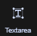

Com o componente  “Textarea” você consegue adicionar valores do tipo letras e números, com uma área maior que uma linha.

Selecione o componente “Textarea”, então arraste-o e solte-o onde está escrito “Drop new field here!”. Quando soltá-lo, irá aparecer do lado direito da tela uma aba chamada

“Properties of Field” (Se não aparecer, apenas clique no campo que você acabou de soltar).

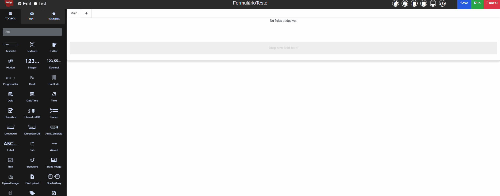

Execute a aplicação

E na tela de registrar, no campo do “Textarea” você pode adicionar valores do tipo letras e números, com 2 linhas ou mais (pode-se adicionar mais linhas na seção “Presentation”, em “Rows”)

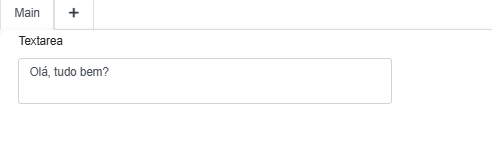

Após salvar:

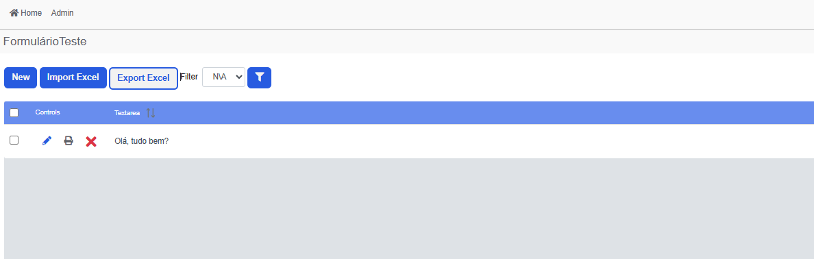

🔗Vídeo: https://www.youtube.com/watch?v=5M0pQUNpSHc&list=PLTHIfO0UrihGXWtezzJnmZgS74lfA3PdH&index=12

### TextArea 📄 > PRESENTATION 📊

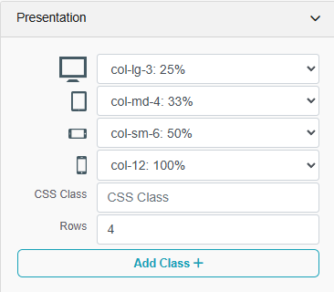

Para saber mais sobre como usar essa funcionalidade, vá até a seção “Presentation” do componente “Textfield”.

O item “Rows” se refere a quantas linhas você quer para o seu componente “Textarea”. Por exemplo, se colocar “4”, perceberá que o componente aumentou para 4 linhas.

## Editor 🎬
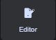

É um componente que permite o usuário inserir texto com a formatação desejada.

Selecione o componente “Editor”, então arraste-o e solte-o onde está escrito “Drop new field here!”. Quando soltá-lo, irá aparecer do lado direito da tela uma aba chamada “Properties of Field” (Se não aparecer, apenas clique no campo que você acabou de soltar).

Execute a aplicação:

E aqui você pode editar o texto com a formatação que quiser (sublinhado, negrito, entre outros), pode adicionar links, emojis e várias outras coisas.

Após adicionar as informações que quiser, clique no botão .

E irá aparecer da seguinte forma:

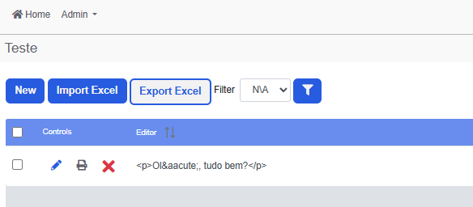

Para editar o registro adicionado, clique no botão 
 (embaixo de “Control”).
 
🔗Vídeo: https://www.youtube.com/watch?v=cfZNgUaZ1vc

## Hidden 🙈
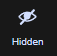

Com este componente você pode calcular valores que são ocultos ao usuário final, e enviar para salvar no banco de dados e consultar posteriormente em relatórios.

Selecione o componente “Hidden”, então arraste-o e solte-o onde está escrito “Drop new field here!”. Quando soltá-lo, irá aparecer do lado direito da tela uma aba chamada “Properties of Field” (Se não aparecer, apenas clique no campo que você acabou de soltar).

Para aprender como usar o componente “Hidden”, acesse o tutorial do componente “Signature”.

### Hidden 🙈 > DATA TYPE 🗃️

Em Type você pode selecionar uma das 5 opções possíveis:
<ol>
 <li>String (para campos de texto)</li>
 <li>Integer (para números inteiros)</li>
 <li>Decimal (para números decimais)</li>
 <li>DateTime (para data e hora)</li>
 <li>Boolean (para verdadeiro ou falso)</li>
 <li>Guid ( é um código único)</li>
</ol>
 
Default Value: Valor padrão (o valor será preenchido automaticamente, mas sendo possível alterar caso necessário).

## Integer 🔢
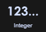
 
É um componente utilizado para quando se necessita digitar números inteiros para uma aplicação.

Selecione o componente “Integer”, então arraste-o e solte-o onde está escrito “Drop new field here!”. Quando soltá-lo, irá aparecer do lado direito da tela uma aba chamada “Properties of Field” (Se não aparecer, apenas clique no campo que você acabou de soltar).

Execute a aplicação.

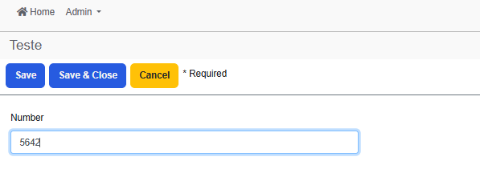

Perceba que só é possível  inserção de números dentro do campo.

Após salvar, estará disposto da seguinte forma na tela dos registros:
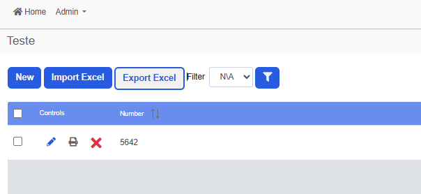

🔗Vídeo: https://www.youtube.com/watch?v=hP0mfTJ18Qs&list=PLTHIfO0UrihGXWtezzJnmZgS74lfA3PdH&index=14

### Integer 🔢 > VALUES 1️⃣
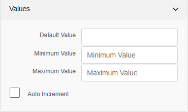

Em  “Values”, existem 3 campos e uma caixa de seleção, que são respectivamente: Default, Minimum Value, Maximum Value e Auto Increment.

Default: se refere a um preenchimento automático de valor, por exemplo, insira no campo “Default” o valor “10”.

Execute a aplicação:
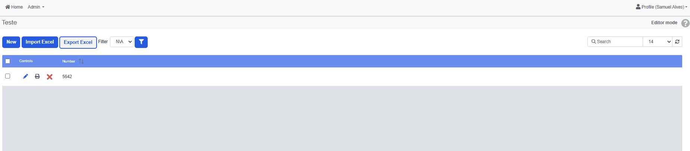

Clique no botão . 

Observe que já está preenchido com “10”, mas é possível alterá-lo.

Minimum Value: se refere ao valor mínimo do número a ser usado no preenchimento do campo. Para testar, preencha esse campo com “5”.

Execute a aplicação.

Preencha o campo com “4” e depois com “5” e observe que o valor mínimo a ser inserido é “5”  para ser possível salvar as informações inseridas no campo.

Maximum Value: se refere ao valor máximo do número a ser usado no preenchimento do campo. Para testar, preencha esse campo com “15”.

Execute a aplicação. 

Preencha o campo com “15” e depois com “16” e observe que o valor máximo permitido é “15”  para ser possível salvar as informações inseridas no campo.

Auto Increment: Irá iniciar com o valor 1 e depois continuar com a sequência (2,3,4…) de forma automática. Se tiver um valor inicial definido, por exemplo, “34”, irá continuar a partir dele (35,36,37…), igual nas imagens de exemplo a seguir:
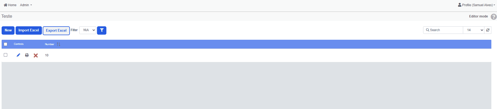

## Decimal 💲
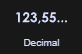

É um componente usado para digitar números decimais para uma aplicação.

Selecione o componente “Decimal”, então arraste-o e solte-o onde está escrito “Drop new field here!”. Quando soltá-lo, irá aparecer do lado direito da tela uma aba chamada “Properties of Field” (Se não aparecer, apenas clique no campo que você acabou de soltar).

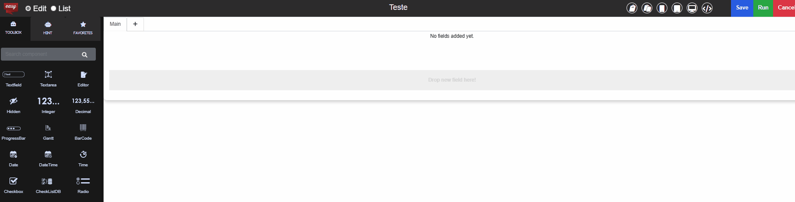

Execute a aplicação.

Perceba que na tela de registrar a estrutura padrão é de número decimal.

Após adicionado e salvo, estará disposto da seguinte forma na tela dos registros:

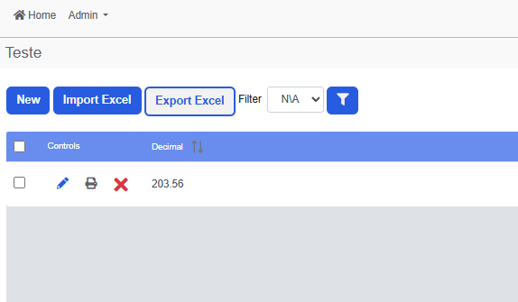

🔗Vídeo: https://www.youtube.com/watch?v=IS_NL5Txe7A&list=PLTHIfO0UrihGXWtezzJnmZgS74lfA3PdH&index=15

### Decimal 💲 > VALUES 1️⃣


Para saber mais sobre como usar essa funcionalidade, vá até a seção “Values” do componente “Integer”.

Scale: Se refere a quantidade de algarismos após o ponto ou vírgula, por exemplo, adicione o valor “5” no campo do “Scale”. Ao executar a aplicação, ficará parecido com a seguinte imagem:


Perceba que há cinco algarismos após o ponto.

### Decimal 💲 > EVENTS ⚙️

Para testar a seção “Events” vamos apagar os campos criados anteriormente com o componente “Decimal” e deixar vazio o formulário.

Agora, selecione e arraste 3 componentes “Decimal”, um do lado do outro.
Nomeie o primeiro de “Number1”, o segundo de “Number2” e o terceiro de “Total” (Igual na imagem abaixo)


Iremos realizar a seguinte função: ao preencher o valor do “Number1” e do “Number2” automaticamente será dado o resultado da soma desses dois campos no “Total” 

Clique no botão (se localiza na seção “Events”) do campo “Total”  e automaticamente abrirá essa aba:


Nesse campo do “Custom Scripts” copie e cole o seguinte:

                                                    function soma() {
                                    this.entity.Total = this.entity.Number1 + this.entity.Number2;
                                    }

Agora volte para o “Form Design”  do lado de “Dev Properties”, no topo da página. 
(Imagem abaixo)


Clique no campo “Number1”, vá na seção “Events”, em “Name” selecione a opção “onkeyup” e em “On” escreva “soma()” e então clique no botão 
.


Após clicar no botão, ficará assim:


Faça a mesma coisa com o campo “Number2”.

Execute a aplicação.


Então clique no botão .

Abrirá a seguinte página:

No “Number1” insira o valor “2.55”, e no “Number2” insira o valor “1.32” e automaticamente irá aparecer o valor “3.87” no campo “Total”. Você pode testar com outros valores se quiser.

Após adicionar os valores, clique no botão 
.

## ProgressBar 📶


O componente "Progress Bar" cria uma barra de progresso com um valor definido previamente.

Selecione o componente, então arraste-o e solte-o onde está escrito “Drop new field here!”. Quando soltá-lo, irá aparecer do lado direito da tela uma aba chamada “Properties of Field” (Se não aparecer, apenas clique no campo que você acabou de soltar).


## ProgressBar 📶 > VALUES

Em "Default Value", insira o valor de progresso da barra.


## ProgressBar 📶 > OTHERS

Em "Unit", defina a unidade de medida do progresso. O uso mais comum é o da porcentagem (%).


Execute a aplicação.

Ao criar um novo registro, o componente estará disposto dessa maneira:


## Gantt 📊📅


Com o componente "Gantt" é possível acompanhar o progresso de tarefas através do tempo.

⚠️ Para o funcionamento desse componente, será necessário criar dois forms extras: Projetos e Tarefas.

No form "Projetos", registre o nome dos projetos em um Textfield.


No form "Tarefas", registre as seguintes informações:

- Projeto (DropdownDB);
- Tarefa (Textfield);
- Tarefa principal (DropdownDB);
- Data de início planejada (Date);
- Data de término planejada (Date);
- Data de início real (Date);
- Data de término real (Date);
- Progresso da tarefa (Integer).


💡O DropdownDB de Projeto deve referenciar o textfield do Form "Projetos".

💡O DropdownDB Tarefa Principal deve referenciar o campo Tarefa desse form "Tarefas".

🚨As labels dos componentes podem variar, porém TODOS eles são INDISPENSÁVEIS para o funcionamento do componente "Gantt".

Segue exemplo de registros de Projetos e Tarefas, respectivamente.


Agora crie uma page e insira o componente "Gantt", arrastando-o e soltando-o onde está escrito “Drop new field here!”.


### Gantt 📊📅 > SOURCE 🔌


Em "DataSource", clique no botão  para criar um novo DataSource.

Insira um título, selecione o form "Tarefas" e marque todos os campos desse form.


Clique em .

Agora selecione o DataSource criado.

Em "Id (Primary Key)", selecione a chave primária do form "Tarefas".


Em "Parent", selecione o campo "Tarefa principal".


Em "Name", selecione o campo "Tarefa".


Em "Progress", selecione o campo "Progresso da tarefa".


Em "Start Date Planned", selecione o campo "Data de início planejada".


Em "End Date Planned", selecione o campo "Data de término planejada".


Em "Start Date", selecione o campo "Data de início real".


Em "End Date", selecione o campo "Data de término real".


Aumente a apresentação do componente para 100%.


Execute a aplicação e teste a funcionalidade.


🔗Vídeo: https://www.youtube.com/watch?v=GfUIl304zrs

## Date 📆 


Com o componente “Date” é possível adicionar uma data, data atual, uma data pré-definida ou uma outra data qualquer preenchida pelo usuário.

Selecione o componente “Date”, então arraste-o e solte-o onde está escrito “Drop new field here!”. Quando soltá-lo, irá aparecer do lado direito da tela uma aba chamada “Properties of Field” (Se não aparecer, apenas clique no campo que você acabou de soltar).

Execute a aplicação

Na tela de registrar, o campo estará disposto da seguinte maneira:


Perceba que o formato é de mês/dia/ano. Então é só selecionar a data e depois salvar:


🔗Vídeo: https://www.youtube.com/watch?v=ZINKzaGHI-w&list=PLTHIfO0UrihGXWtezzJnmZgS74lfA3PdH&index=16

### Date 📆 > VALUES 1️⃣

Default (Padrão): O campo será preenchido com uma data pré-determinada, mas é possível alterar, se necessário.

Por padrão o formato está “mm/dd/yyyy” que significa “mês/dia/ano”. 

Current Date (Data atual). Ao selecionar essa caixa, o campo “Date” sempre estará preenchendo automaticamente com a data atual.

## DateTime 📆⏲️ 


Com este componente você pode adicionar uma data e horário atual, data e horário pré definido ou uma outra data e horário qualquer preenchida pelo usuário

Selecione o componente “DateTime”, então arraste-o e solte-o onde está escrito “Drop new field here!”. Quando soltá-lo, irá aparecer do lado direito da tela uma aba chamada “Properties of Field” (Se não aparecer, apenas clique no campo que você acabou de soltar).

Execute a aplicação.


Perceba que a data está no formato mês/dia/ano e o horário está no formato AM/PM.


Após salvar, estará disposto da seguinte forma na tela dos registros:


🔗Vídeo: https://www.youtube.com/watch?v=Qw93cdchp-c&list=PLTHIfO0UrihGXWtezzJnmZgS74lfA3PdH&index=17

### DateTime 📆⏲️ > VALUES 1️⃣


Default (Padrão): O campo será preenchido com uma data e horário pré-determinado, mas é possível alterar, se necessário.

Por padrão o formato está “mm/dd/yyyy” que significa “mês/dia/ano”. 

  “ --:-- --” é o formato padrão de horário da américa do norte, por exemplo, 04:45 AM ou 9:03 PM que no sistema brasileiro seriam 04:45 e 21:03 respectivamente.

Current Date/Time (Data e horário atual): Ao selecionar essa caixa, o campo “DateTime” sempre estará preenchendo automaticamente com a data e horário atual.

## Time ⌛ 


Com este componente você pode adicionar um horário atual, horário pré definido ou um outro horário qualquer preenchida pelo usuário.

Selecione o componente “Time”, então arraste-o e solte-o onde está escrito “Drop new field here!”. Quando soltá-lo, irá aparecer do lado direito da tela uma aba chamada “Properties of Field” (Se não aparecer, apenas clique no campo que você acabou de soltar).


Execute a aplicação.

O componente estará disposto da seguinte maneira na tela de registrar:


Perceba que está no formato “--:-- --”, isso quer dizer que o horário é em AM/PM (AM para antes do meio dia e PM para depois do meio dia). 

Após salvar o horário, a tela dos registros estará disposta da seguinte maneira:


Vídeo: https://www.youtube.com/watch?v=9kFXdYT4GAY&list=PLTHIfO0UrihGXWtezzJnmZgS74lfA3PdH&index=18

### Time ⌛ > VALUES 1️⃣


Default (Padrão): O campo será preenchido com uma horário pré-determinado, mas é possível alterar, se necessário.

## CheckBox ✅


O componente  “Checkbox” é uma caixa de seleção que permite o usuário a fazer uma escolha binária, ou seja, uma escolha entre duas opções mutuamente exclusivas..

Selecione o componente “Checkbox”, então arraste-o e solte-o onde está escrito “Drop new field here!”. Quando soltá-lo, irá aparecer do lado direito da tela uma aba chamada “Properties of Field” (Se não aparecer, apenas clique no campo que você acabou de soltar).


Escreva “Obrigatório” nos campos “Name” e “Label” que se encontram na seção “General” do ”Properties of Field” do checkbox.     
 

Agora execute a aplicação.
Na tela de registrar você consegue visualizar o componente:


Após salvá-los, estará dispostos da seguinte forma na tela de registros:


### CheckBox ✅ > VALUES 1️⃣


A caixa de seleção “Default Value” se refere ao campo já estar marcado ou não na hora de realizar os registros.

🔗Vídeo: https://www.youtube.com/watch?v=BSVBdBxE4sA&list=PLTHIfO0UrihGXWtezzJnmZgS74lfA3PdH&index=19

## ChecklistDB 📁


Este componente cria uma lista de controle que será conectada a um DataSource. Os registros podem ser inseridos pelo usuário final.

Selecione o componente “ChecklistDB”, então arraste-o e solte-o onde está escrito “Drop new field here!”. Quando soltá-lo, irá aparecer do lado direito da tela uma aba chamada “Properties of Field” (Se não aparecer, apenas clique no campo que você acabou de soltar).


Para visualizar a utilização desse componente, desça até a seção “Source” deste tutorial.

*** Entre em contato com o suporte da easy comtec para utilizar esse componente ****

### ChecklistDB 📁 > PRESENTATION 📊


Para poder visualizar as diferenças de apresentação, é obrigatório que já tenha adicionado valores na seção “Values”.

Para saber mais sobre como usar essa funcionalidade, vá até a seção “Presentation” do componente “Textfield”.

Em “Style” você tem três opções que pode selecionar: “Fixed”, “Fluid” ou “Vertical”. Selecione cada opção e perceba a diferença na disposição visual dos itens.

### ChecklistDB 📁 > SOURCE 🔌


Para fazer funcionar o componente “ChecklistDB” é necessário puxar os dados de outro formulário/datasource. 

Logo, é necessário, que tenha criado esse outro formulário/banco de dados, e após atualizar a lista, apenas selecione a “Class” desse outro.
<table>
  <tr>
   <td>Source Field:</td>
   <td>Label Field:</td>
   <td>Picture Field:</td>
 </tr>
</table>

## Radio 🔘


Com o componente “Radio” você pode fornecer uma lista de opções mas selecionar apenas uma opção como verdadeira.

Selecione o componente “Radio”, então arraste-o e solte-o onde está escrito “Drop new field here!”. Quando soltá-lo, irá aparecer do lado direito da tela uma aba chamada “Properties of Field” (Se não aparecer, apenas clique no campo que você acabou de soltar).


Para utilizar 
desça até a seção “Values” desse tutorial para aprender como usar esse componente.

Vídeo: https://www.youtube.com/watch?v=RPHA64EMDEE&list=PLTHIfO0UrihGXWtezzJnmZgS74lfA3PdH&index=20

### Radio 🔘 > VALUES 1️⃣


Aqui você irá adicionar os valores, por exemplo, criar listas com as opções para selecionar, lembrando que apenas uma opção poderá ser selecionada com esse componente.

Agora clique no botão 
, automaticamente abrirá a janela modal “Enumerations” (imagem na próxima página), em “Name” escreva “Gênero”, em “Type” mantenha a opção “String”, em "MaxLenght" mantenha a opção "0".

Clique no botão 
 e adicione “Masculino”, denovo clique 
e adicione a opção  “Feminino” e então clique no botão 
 . (Imagem na próxima página)

 

Três coisas importantes de saber sobre a janela “Enumerations”:
Em “Type” você tem duas opções que pode selecionar: “String” ou “Integer”. “String” se refere a palavras, “Integer” se refere a números.
“Max Length” se refere a quantidade máxima de caracteres que cada opção terá.    
E na opção  podemos adicionar um alerta quando selecionamos a opção.


Ainda na seção “Values”,  tem o item “Default”, clicando nele irá aparecer as opções “Masculino” e “Feminino”, isso quer dizer que se você selecionar um desses dois agora, na hora de preencher o formulário um deles já estará selecionado, mas ainda será possível mudar caso queira. 

Execute a aplicação.

O componente será visto da seguinte maneira na tela de registrar:


## Dropdown 🗄️


O componente “Dropdown” serve para você fornecer uma lista de opções em formato de menu.

Selecione o componente “Dropdown”, então arraste-o e solte-o onde está escrito “Drop new field here!”. Quando soltá-lo, irá aparecer do lado direito da tela uma aba chamada “Properties of Field” (Se não aparecer, apenas clique no campo que você acabou de soltar).


Na seção “Values” do “Properties of Field”, clique no botão 
, irá aparecer a seguinte janela modal:


Em “Name” escreva veículo, então clique no 
. Irá a aparecer o seguinte embaixo do botão:


Edite o “Option A” para “Carro”. Adicione mais duas opções e altere-as para “Moto” e “Caminhão”. 


Clique no botão
 , e após salvo, voltará automaticamente para a tela de design do formulário. 

Execute a aplicação.

Na tela de registrar, o “Dropdown” funcionará da seguinte forma:


🔗Vídeo: https://www.youtube.com/watch?v=QsfoAgq2EIs&list=PLTHIfO0UrihGXWtezzJnmZgS74lfA3PdH&index=21

### Dropdown 🗄️ > VALUES 1️⃣

Para saber mais sobre como usar essa funcionalidade, vá até a seção “Values” do componente “Radio”.

## DropdownDB 📥


O componente “DropdownDB” serve para você fornecer uma lista de opções em formato de menu a partir de um DataSource. O usuário final consegue inserir dados nessa lista.

 (Obs: A única diferença entre o “AutoComplete” e o “DropdownDB” é que o “AutoComplete” aparece quando é pesquisado e o “DropdownDB” aparece numa lista)

Selecione o componente “DropdownDB”, então arraste-o e solte-o onde está escrito “Drop new field here!”. Quando soltá-lo, irá aparecer do lado direito da tela uma aba chamada “Properties of Field” (Se não aparecer, apenas clique no campo que você acabou de soltar).


Para aprender como usar esse componente, desça até a seção “Source” deste tutorial.

### DropdownDB 📥 > SOURCE 🔌


Nessa seção “Source” serão trazidos o conjunto de valores inseridos em outro campo, que pode ser de outro ou do mesmo formulário, desde que seja sob o mesmo projeto.

Então, vamos começar criando mais um formulário (igual demonstrado no tutorial “Como Criar Seu Primeiro Projeto, Menu e Formulário”).

E nesse novo formulário vamos adicionar o componente “Textfield” chamado "Cor" para dentro dele.


Na seção “General”,Nomeie os campos “Name” e “Label”, de “Cor”.
  


Agora execute a aplicação.       
Irá abrir a seguinte página:


No campo “Cor” escreva “Vermelho”, clique no botão 
.. 


Repita o processo para adicionar as cores “Verde”, “Amarelo” e “Azul.


Agora vamos voltar para o outro formulário com o componente “DropdownDB”.


E então em “Properties of Field”, desça até “Source” e em “Class” selecione o formulário que foi criado o campo “Cor” e em “Description Field” selecione o campo “Cor”.

Execute a aplicação.


Clique no botão  e irá abrir a seguinte página:

Selecione o campo do DropDownDB:       


E você irá visualizar os valores adicionados no campo “Cor” do outro formulário. Selecione uma opção e então clique no botão 

:
 Você pode realizar o mesmo processo com ambos os campos no mesmo formulário.
Ainda na seção “Source”, em “Additional Data” você pode adicionar outro conjunto de valores de um campo desde que seja do mesmo formulário selecionado no “Class”.

## AutoComplete 🗄️🧲


O componente “AutoComplete” serve para fornecer auto-completar a inserção do item a partir de um DataSource. O usuário final consegue inserir dados nessa lista.

A única diferença entre o “AutoComplete” e o “DropdownDB” é que o “AutoComplete” aparece quando é pesquisado e o “DropdownDB” aparece numa lista.

Ou seja, sabendo utilizar o “DropdownDB” você também saberá utilizar o componente “Autocomplete”

Selecione o componente “Dropdown”, então arraste-o e solte-o onde está escrito “Drop new field here!”. Quando soltá-lo, irá aparecer do lado direito da tela uma aba chamada “Properties of Field” (Se não aparecer, apenas clique no campo que você acabou de soltar).

Na seção “Source”, em “Class”  do “Autocomplete” selecione a opção “Cor” e em “Description Field” também selecione “Cor” 

(O formulário “Cor” e campo “Cor” com os registros de “Vermelho”,”Verde”, “Azul” e “Amarelo” foram criados durante o tutorial do componente “DropdownDB”).

Agora execute a aplicação.

Na tela de registrar, perceberá que ao escrever as letras iniciais, irá aparecer as opções disponíveis:


E então é só selecionar a opção desejada e prosseguir.

🔗Vídeo: https://www.youtube.com/watch?v=l0tQAqhDfVk&list=PLTHIfO0UrihGXWtezzJnmZgS74lfA3PdH&index=24

### AutoComplete 🗄️🧲 > FILTER 📮


Filter Name: Filtrar nome.

Filter Value: Filtrar valor.

### AutoComplete 🗄️🧲 >  SOURCE 🗂️


Class (classe, nome do formulário ou datasource)
Description Field (Campo de descrição)

Allow add and edit (Permitir adicionar e editar)

Enable barcode scanner (Habilitar scanner de código de barras)

Additional Data (Dados adicionais)

Source From (Fonte de)

To (Para)

## Label 🔤


Com este componente você pode apresentar valores do tipo letras e números, estes valores não serão gravados no banco de dados.

Selecione o componente “Label”, então arraste-o e solte-o onde está escrito “Drop new field here!”.

 No campo do “Label”, da seção “General” do “Properties of Field”, clique no botão 
 para fazer a importação de um documento de texto do seu computador.
 


* O documento de texto tem que ser formato “.txt”.

Clique no botão 
 para fazer o upload do documento.

Para esse tutorial eu criei o seguinte documento:

Perceba que cada item está em uma linha, isso tornará possível criar as opções.

Selecione a primeira opção, e clique no botão 

Execute a aplicação.


E após salvar, não será salvo no banco de dados, pois esse texto é apenas para orientação dentro do formulário.


🔗Vídeo: https://www.youtube.com/watch?v=SM_LHGXmJm0&list=PLTHIfO0UrihGXWtezzJnmZgS74lfA3PdH&index=25

## Wizard 🛤️


O componente "Wizard" cria um fluxo de etapas e orienta o usuário através de uma fácil navegação, com os botões "Back" e "Next".

Selecione o componente “Wizard”, arrastando-o e soltando-o onde está escrito “Drop new field here!”.


Clique em "Step 0" e renomeie sua label.


Para adicionar componentes a etapa, há um espaço “Drop new field here!” dentro do componente "Wizard".


Para criar uma nova etapa, clique em "New Step +".


Note que agora o botão "Back" está disponível, possibilitando o retorno à etapa anterior.


Crie uma nova etapa e retorne ao "Step 1".


Note que agora está disponível também o botão "Next", possibilitando o retorno e o avanço entre as etapas.


Para excluir uma etapa, clique em "Delete".


Execute a aplicação e teste a funcionalidade.


## Box 📦


Com este componente você pode criar seções dentro do formulário, para organizar os componentes que estarão dentro dele e realizar funcionalidades conjuntas (das regras de visibilidade, por exemplo).

Isso permitirá economizar tempo na hora de editar as seções do “Properties of Field”, por exemplo, criando regra de visualização para todo o conjunto de componentes dentro do groupbox.

Selecione o componente “Box”, então arraste-o e solte-o onde está escrito “Drop new field here!”. Quando soltá-lo, irá aparecer do lado direito da tela uma aba chamada “Properties of Field” (Se não aparecer, apenas clique no campo que você acabou de soltar).

Ira aparecer varias opções de layout, bastas selecionar a que melhor se encaixa para você.


Agora arraste um componente “Textfield” e um “Integer” para dentro do “Groupbox” no campo aonde está escrito "Drop new field here!" e nomeie o textfield de “Letra”, e o “Integer” de “Número”:


E agora, selecionando o box você consegue configurar o “Behavior”, “Presentation” e “Intro” de todos os componentes dentro dele de uma vez só. 

Para saber mais sobre como editar e visualizar essas configurações do “Properties of Field”, acesse as seções “General”, “Behavior”, “Presentation” e “Intro” do componente “Textfield”.

Obs: também é possível editar essas propriedades para cada componente individualmente dentro do GroupBox.

Execute a aplicação.


Adicione os valores nos dois campos e depois clique no botão 
.


🔗Vídeo: https://www.youtube.com/watch?v=1F6CkX0M4P4

### Box 📦 > GENERAL 🎖️

Para saber mais sobre como usar essa funcionalidade, vá até a seção “General” do componente “Textfield”.


Ao selecionar caixa "Border", será criado a borda para o componente, e também será possível editar o campo “Label”.

Ao selecionar caixa "Collapsible", será criada uma box como caixa suspensa, e também será possível editar o campo “Label”.

🔗Vídeo: https://www.youtube.com/watch?v=1F6CkX0M4P4

## Signature ✒️

Com este componente você pode adicionar uma assinatura do usuário no seu formulário.

Selecione o componente “Signature”, então arraste-o e solte-o onde está escrito “Drop new field here!”. Quando soltá-lo, irá aparecer do lado direito da tela uma aba chamada “Properties of Field” (Se não aparecer, apenas clique no campo que você acabou de soltar).


Para total visualização do processo da utilização do componente “Signature” será necessário realizar as etapas dos tutoriais “Como Adicionar Um Usuário” e “Como Dar Permissão Ao Usuário”.

Para fazer funcionar o componente “Signature” será preciso ter mais um componente “DateTime” ou “Date” e dois componentes “Hidden”.

Então, primeiro, vamos adicionar o componente “DateTime” e nomeá-lo de “Data e Hora”, e vamos nomear o componente “Signature” de “Assinatura”.

Selecione a caixa de seleção “Current DateTime” da seção “Values” do componente “DateTime”(Data e Hora) para sempre estar pegando a data e horário atual.

Agora selecione e solte os 2 componentes “Hidden” em cima do “Assinatura” e do “Data e Hora”

Selecione o primeiro “Hidden” que está acima do “Assinatura” e o nomeie de “Hidden da Assinatura”. 
E na seção “Data Type”, em “Type” selecione a opção “String”. (imagem abaixo)

E no “Hidden” que está acima acima do “DateTime” o nomeie de “Hidden do DateTime”. 
E na seção “Data Type”, no item “Type” selecione a opção “DateTime”. (imagem abaixo)

Agora vá até a seção “Signature” do componente “Signature”. No item “Date field” selecione a opção “Data e Hora” e no “Info field” selecione a opção  “Hidden Assinatura”.


Execute a aplicação.

Então irá abrir a seguinte tela:


Agora copie a URL (Link) desse formulário:


E então abra em uma janela anônima:


Entre com seu usuário. 

[Para continuar daqui em diante, é necessário ter realizado os passos dos tutoriais “Como Criar Seu Usuário” e “Como Dar Permissão Ao Seu Usuário”]
 
Aparecerá a seguinte tela:

Clique no botão 
 e abrirá a seguinte tela:


Clique na caixa amarela “Click to Sign”, e aparecerá a seguinte janela:

Então é só desenhar a assinatura, por exemplo: 

E então clicar no botão . Automaticamente voltará para essa página:


Então clique no botão .

Será direcionado para a seguinte página:

E aqui você consegue visualizar os registros.

Para visualizar o formulário preenchido com a assinatura, é só clicar no  (abaixo de “Control”).

### Signature ✒️ > SIGNATURE ✒️🗄️


Date field: Selecionar o campo que contém o componente “Date” ou “DateTime”.

Info field: Selecionar o campo que contém o componente “Hidden” atrelado à assinatura.

## Static Image 🌄

Com este componente você pode adicionar uma imagem que sempre estará sendo mostrada no formulário e não será salva dentro do banco de dados. 

Sobre as imagens é possível adicionar eventos como abrir outros forms ou hiperlink para outros sites. 

Selecione o componente “Image”, então arraste-o e solte-o onde está escrito “Drop new field here!”. Quando soltá-lo, irá aparecer do lado direito da tela uma aba chamada “Properties of Field” (Se não aparecer, apenas clique no campo que você acabou de soltar).


Agora siga o GIF abaixo para adicionar sua imagem:


Agora execute a aplicação.

A imagem aparece no formulário, mas não será salva no banco de dados. Ela pode servir como referência instrutiva, logomarca ou hiperlink, entre outros.

🔗Vídeo: https://www.youtube.com/watch?v=S0gTJ196YeU

### Static Image 🖼️ > IMAGE 🚞

Na seção “Image” do componente “Image” você pode dar descrição (“Description”) e um link, para qual será direcionado quando clicar na imagem. Lembre-se de clicar no 
para adicionar o evento de ao clicar na imagem ser direcionado para o link.    

## Upload Image 📸📩

Este componente permite você adicionar uma imagem com o formato desejado que ficará visível no registro

Selecione o componente “ImageInput”, então arraste-o e solte-o onde está escrito “Drop new field here!”. Quando soltá-lo, irá aparecer do lado direito da tela uma aba chamada “Properties of Field” (Se não aparecer, apenas clique no campo que você acabou de soltar).


Execute a aplicação clicando no botao :

Agora Siga o GIF abaixo para fazer o Upload da Imagem:


Para visualizar a foto que você acabou de adicionar, clique no botão (Abaixo de “Control”)

🔗Vìdeo: https://www.youtube.com/watch?v=euHhuJY1vSA

### Upload Image 📸 > Upload 🔼 > Public 📮

Use a properiedade `public` quando:
- A imagem não contém dados sensíveis e compartilhar ela não vai expor informação privada
- Você quer otimizar a performance, já que a sua imagem pode ser carregada mais rapidamente por que não gastamos tempo verificando as permissões
- Você está trabalhando em uma página publica(por exemplo, uma landing page) que não vai exigir que o usuário faça log in

Quando você marca um `upload image` como `public` a imagem carregada não será mais protegida pelas configurações de permissão
- Será acessível por usuários, mesmo que você não tenha concedido permissão para que eles vejam os dados do formulário onde a imagem foi salva
- Será acessível por usuários que não fizeram log in
- Será salva em um repositório público de imagens
  

## File Upload 📂📩

É um componente que permite anexar arquivos em um cadastro.

Selecione o componente “FileUpload”, então arraste-o e solte-o onde está escrito “Drop new field here!”. Quando soltá-lo, irá aparecer do lado direito da tela uma aba chamada “Properties of Field” (Se não aparecer, apenas clique no campo que você acabou de soltar).


Salve apertando o botao  e Depois
Execute a aplicação clicando no botao .

Agora siga o GIF abaixo para fazer o upload do arquivo desejado:


Após o passo acima você Irá para a tela dos registros abaixo:

Caso queira visualizar o registro do “FileUpload”, clique no (Control).

Então irá para a seguinte tela (próxima página):

E para fazer o download do arquivo é só clicar no botão 
.

🔗Vídeo: https://www.youtube.com/watch?v=Hk_XcIS_U_E

### File Upload 📂📩 > UPLOAD 🗂️

É possível fazer upload de arquivos dos seguintes formatos:
<table>
 <tr>
  <td>Word</td>
  <td>Powerpoint</td>
  <td>Powerpoint</td>
  <td>PDF</td>
  <td>Excel</td>
  <td>TXT</td>
  <td>Imagens</td>
 </tr>
 </table>
 
Se deixar todas as caixas de seleção desmarcadas, será possível fazer o upload de qualquer um dos formatos. Se selecionar apenas um deles, será possível fazer upload de arquivo apenas daquele formato.

### File Upload 📂📩 > OTHERS 🖥️

Ao selecionar a caixa de seleção “Allow to delete file from storage” será permitido deletar arquivos do storage (onde ficam armazenados os arquivos) .

## One-To-Many 📃➡️📃

Com este componente você consegue realizar uma relação de um para vários, por exemplo: Sala de aula - quem são os alunos, empresa - quem são os colaboradores.

Selecione o componente “OneToMany”, então arraste-o e solte-o onde está escrito “Drop new field here!”. Quando soltá-lo, irá aparecer do lado direito da tela uma aba chamada “Properties of Field” (Se não aparecer, apenas clique no campo que você acabou de soltar).

Nas propriedades do “OneToMany”, na seção “Source”, adicione a opção “Cor” (Esse formulário “Cor” foi criado durante o tutorial do “DropdownDB”).

É importante que esteja logado na tela de registros do formulário “Cor” para poder visualizar o resultado do processo. No momento, a tela de registro de cores está da seguinte maneira:

                            
Volte na tela do One-To-Many e execute a aplicação.

No campo “Cor”, preencha com “Laranja”, então clique no botão.

Então, clique no botão .

A tela dos registros do One-To-Many estará da seguinte forma:

Agora, abra a tela dos registros das cores e atualize ela 

Perceba que a cor “Laranja” foi adicionada na tela de registro do formulário “Cor”.

 Open as Modal: Abrir como um modal. Um modal é uma janela em destaque dentro da página (igual aquela quando se cria ou edita um projeto).

Source (Fonte): É da onde os dados serão buscados.

Refresh Source (Atualizar fonte): Ás vezes pode ter sido criado o source recentemente mas a lista não ter sido atualizada, para isso serve o botão.

### One-To-Many 📃➡️📃 > Aggregation Data

<table>
 <tr>
  <td>Source (Fonte)</td>
  <td>Destination (Destino)</td>
  <td>Operation (Operação)</td>
  <td>Column (Coluna)</td>
  <td>Output (Resultado)</td>
 </tr>
</table>

## Multi Upload 📂➕


O componente "Multi Upload" permite que o usuário faça upload de diversas imagens ou arquivos.

⚠️ O componente requer que os arquivos sejam armazenados em um form criado previamente. Por isso, antes de utilizá-lo, crie um form contendo o componente "File Upload". Segue exemplo:


Feito isso, selecione o componente “Multi Upload”, arrastando-o e soltando-o onde está escrito “Drop new field here!”.


### Multi Upload 📂➕ > UPLOAD 🗂️


Em "Accepted Types", selecione os formatos de arquivos desejados.

Em "Max. File Size", insira o tamanho máximo de arquivo aceito.

### Multi Upload 📂➕ > SOURCE 🔌


Em "Form", selecione o form criado anteriormente.


Em "DataSource", clique no botão  para criar um novo DataSource.

Insira um título, selecione o form criado anteriormente e marque o campo "File Upload".


Clique em .

Agora selecione o DataSource criado.


Em "Upload Field", selecione o campo "File Upload".


Execute a aplicação e teste a funcionalidade.


## MultiTag 🏷️

É um componente que funciona como um autocomplete para múltiplos valores (relação 1:N).

Selecione o componente “MultiTag”, então arraste-o e solte-o onde está escrito “Drop new field here!”. Quando soltá-lo, irá aparecer do lado direito da tela uma aba chamada “Properties of Field” (Se não aparecer, apenas clique no campo que você acabou de soltar).


Para realizar o tutorial desse componente, desça até a seção “Source”.

### MultiTag 🏷️ > SOURCE 🔌


Para fazermos uso do componente “MultiTag” teremos que criar 3 formulários. O primeiro para adicionar os nomes, o segundo para conectar os nomes a um componente “DropdownDB”, e então conectar o segundo com o terceiro formulário que será do “MultiTag”.

Primeiro passo, crie um novo formulário com o componente “Textfield”, também nomeando-o de “Membro da Equipe” .

e adicione os nomes “João”, “Maria”, “Carlos” e “Lucas”.

Segundo passo, crie mais um formulário usando o componente “DropdownDB” e nomeando-o de “reunião da equipe”.

Na seção “Source” desse componente, no item “Form” selecione a opção “Membro_da_Equipe”  e em “Description Field” também selecione “MembroDaEquipe”. 

Clique no botão  no pé da página.

Agora vamos criar o terceiro formulário, nomeando-o de “Participantes”.  Adicione o componente “Multitag” para dentro do formulário.

Agora na seção “Source” do MultiTag, no item “Form” selecione “reuniao_da_Equipe”, e em “Relation Field” selecione “ReuniaoDaEquipeId” - (imagem abaixo).

Execute a aplicação.

Comece a escrever as primeiras letras e logo aparecerá os nomes.     
Selecione “Lucas”, “Maria” e “João”.

E então clique no botão 
.
Irá aparecer da seguinte forma: 

Para visualizar  e editar esse formulário adicionado, clique no botão 
.

## Additional Data ➡️📃

Este componente permite apresentar dados extras através de um DataSource.

Selecione o componente “AdditionalData”, então arraste-o e solte-o onde está escrito “Drop new field here!”. Quando soltá-lo, irá aparecer do lado direito da tela uma aba chamada “Properties of Field” (Se não aparecer, apenas clique no campo que você acabou de soltar).


Para visualizar a utilização desse componente, desça até a seção “Additional Data” deste tutorial

### Additional Data➡️📃 > GENERAL 🎖️


Para saber mais sobre como usar essa funcionalidade, vá até a seção “General” do componente “Textfield”.

Ao selecionar a caixa de seleção , será criado a borda para o componente, e também será possível editar o campo “Label”.

Ao selecionar a caixa de seleção , será criado um colapso no componente, e também será possível editar o campo “Label”.

### Additional Data➡️📃 > SOURCE


Em “DataSource” você irá selecionar o DataSource criado antes. Ao lado, serve para atualizar a lista, e o  serve para adicionar um DataSource. 

Para saber mais sobre como criar um DataSource, desça até o tutorial “DataSource”.

É importante saber que o DataSource é o nome dado a conexão para um banco de dados a partir do servidor. Ou seja, é necessário você criar esse banco de dados, que pode ser  os registros criados dentro de outro formulário.

Logo, é importante também que tenha criado o outro formulário dentro do mesmo projeto, e que tenha o campo adicionado para “puxar” o banco de dados. 

DataSource Filter: irá realizar um filtro dentro do DataSource selecionado, ou seja, se o DataSource tem 10 fields, você pode selecionar se quer  todos ou apenas um deles. 

Source Field: irá puxar as informações do campo origem.

Show (Mostrar): As opções são:“First”, “Last” e “Max” que significam respectivamente “Primeiro”, “Último” e “Máximo”.
 
Sorted by: Irá ordenar o DataSource pela opção escolhida.

Vamos testar isso criando dois formulários. No primeiro vamos nomeá-lo de “Origem”, nesse vamos usar dois componentes: “Textfield” e “Dropdown”.

Arraste o componente “Textfield” para dentro do formulário e o nomeie de “Nome”, faça o mesmo com o componente “Dropdown” e o nomeie com “Status”. 

(Para aprender mais sobre o componente “Dropdown”, acesse o tutorial dele)

No campo do “Status”, em “Values” clique no botão  e adicione dois valores “Aprovado” e “Pendente”.

Execute a aplicação:

No campo do “Nome”  escreva “João Carlos” e do “Status” selecione a opção “Aprovado” e então clique no botão 
.

Repita o processo adicionando o nome “Maria Aparecida” com o Status de “Pendente”.

Agora vamos criar outro formulário, e nomeá-lo de “Destino”.

E vamos arrastar o componente “DropdownDB” para dentro dele e nomeá-lo de “Origem”. 

Na seção “Source” dele, em “Class” selecione a opção “Origem”. Em “Description Field” selecione “Nome”.

Agora selecione o componente “Additional Data” e arraste ao lado do campo “Origem”.

Agora na seção “Source” do componente “Additional Data”, na linha do “DataSource” clique no  e irá abrir a seguinte janela:

Em “Title” escreva “Origem”, em “Class” selecione o projeto no qual você criou os formulários anteriormente, Irá aparecer da seguinte forma:


Clique para marcar a flag nos campos “Nome” e “Status” que estão marcados abaixo da opção "Form", e logo a tela ficará da seguinte maneira:


Perceba que foram adicionados os campos “Nome” e “Status” dentro do DataSource.

Agora clique no botão  . E automaticamente voltará para a tela de edição do formulário:


Agora na seção “Source”, em “DataSource”, selecione a opção “Origem”, em “DataSource Filter” selecione a opção “OrigemId”, em “Source Field” selecione a opção “OrigemId”, em “Show” selecione “First”, em “Sorted By” selecione a opção “Nome”. 
⚠️ATENÇÃO: Nos campos aonde está escrito “AdditionalDateid”, voce ira selecionar o nome do seu formulario que voce selecionou no Class anteriormente. 


Agora selecione e arraste o componente “Label” em cima do “Additional Data” e nomeie ele de "Status" como no GIF abaixo:


Agora na seção “General”, no “DataLinkUrl” selecione a opção “Status”:


Execute a aplicação:

Selecione o nome “João Carlos” e observe a mensagem ao lado:

Selecione o nome “Maria Aparecida” e observe a mensagem ao lado:

## Button ⏸️

Com este componente é possível inserir funções personalizadas de JavaScript.

Selecione o componente “Button”, então arraste-o e solte-o onde está escrito “Drop new field here!”


Para saber mais sobre como usar esse componente, desça até a seção “Events” desse tutorial.

🔗Vídeo: https://www.youtube.com/watch?v=IGGbMFxysPE&list=PLTHIfO0UrihGXWtezzJnmZgS74lfA3PdH&index=31

### Button ⏸️ > GENERAL 🎖️


A opção "Icon" abrira uma lista de opções de icones para customizar o botão.

Para saber mais sobre como usar as outras funcionalidade, vá até a seção “General” do componente “Textfield”.

### Button ⏸️ > EVENTS ⚙️ 

Vamos testar a seção “Events” começando por arrastar um novo componente “Button” dentro do formulário. 

Nesse teste iremos fazer com que ao clicar o botão será mostrado uma mensagem.

Agora, na seção “Events” desse novo botão, iremos clicar no botão .  

Então abrirá a seguinte aba: 

Em “Custom Scripts” copie e cole o seguinte script: 

                                    function alerta() {
            alert('Pode ser usado em alertas, redirecionar para outra página executar uma função javascript');
            }

Então clique no botão 
para testar se o script é válido, se ele for, irá aparecer no topo direito uma mensagem dizendo:  “Confirmation Custom Script Valid”.

Agora volte na seção “Events”, em “Name” selecione a opção “OnClick”, e em “On” escreva “alerta()”
e então clique no botão .         

Então ficará da seguinte maneira:    


Execute a aplicação:

Clique no botão azul  e então irá para a próxima página.

Agora clique no e você verá o seguinte aviso na tela:

## HTML Field 🦰

 É um componente que permite inserir um texto em html no formulário.

Selecione o componente “HTMLField”, então arraste-o e solte-o onde está escrito “Drop new field here!”. Quando soltá-lo, irá aparecer do lado direito da tela uma aba chamada “Properties of Field” (Se não aparecer, apenas clique no campo que você acabou de soltar).


No campo “HTML” abaixo de “General”  (onde está indicando a flecha), você irá colar o seu código HTML.

Por exemplo, uso o código: 

Execute a Aplicação:
Perceba que a palavra “obrigatórios” está em negrito, devido ao código html.


🔗Vídeo: https://www.youtube.com/watch?v=izhSKwdUDvg&list=PLTHIfO0UrihGXWtezzJnmZgS74lfA3PdH&index=32

### HTML Field 🦰 > GENERAL 🎖️

Para saber mais sobre como usar essa funcionalidade, vá até a seção “General” do componente “Textfield”.

HTML: É onde você irá colar o seu código HTML, assim que clicar no icone de lapis, vai abrir a seguinte tela em modal. 

## Quiz 🧩

Este componente cria um questionário de perguntas e respostas onde o usuário adiciona alternativas falsas e verdadeiras, colocando a pontuação das resposta verdadeiras no Score.

Selecione o componente “Decimal”, então arraste-o e solte-o onde está escrito “Drop new field here!”.

Agora Selecione o componente “Quiz”, então arraste-o e solte-o onde está escrito “Drop new field here!”. Quando soltá-lo, irá aparecer do lado direito da tela uma aba chamada “Properties of Field”.(Se não aparecer, apenas clique no campo que você acabou de soltar).

Clique no campo do “Enter Your Question” e escreva “Quanto é 1 + 1 ?” e clique no botão 
.

Clique no icone marcado de vermelho na imagem acima para adicionar as respostas.

No campo do “Enter Your Answer” escreva “2” 
e marque a caixa de seleção  e então clique no botão 
.

Repita essa última etapa adicionando a resposta “3” sem marcar a caixa de seleção 
.

Agora vamos adicionar mais uma questão: “Quanto é 2 + 2 ?”

E adicionar duas respostas: “4” e marcando a caixa de seleção
, e “5” sem marcar a caixa de seleção.

Agora, para que seja possível mostrar o resultado do quiz, vamos utilizar o componente “Decimal” que criamos no começo e vamos nomea-lo de "PorcentagemDeAcerto",agora clique de volta no Quiz, vá até a seção “Others”, em “Score Field” selecione a opção “PorcentagemDeAcerto”.


Execute a aplicação. Irá abrir essa página:

Selecione as opções e perceberá que o campo “Acertos” dará a porcentagem de acerto automaticamente.

Após selecionar as opções desejadas, clique no botão .

Então verá a tela dos registros e caso queira editar o form salvo,
basta clicar no botão 
.

🔗Vídeo: https://www.youtube.com/watch?v=eVAWxyWRydA&list=PLTHIfO0UrihGXWtezzJnmZgS74lfA3PdH&index=33

### Quiz 🧩 > OTHERS 

Para saber mais sobre como usar essa funcionalidade, vá até a seção “Others” do componente “Textfield”.

Score Field: Irá selecionar o campo que está dentro do mesmo formulário para mostrar o resultado do quiz. Esse outro campo deve utilizar o componente “Integer” para cumprir sua função.

## Email 📧

O componente “Email” serve para aceitar somente preenchimento de email.

Selecione o componente “Email”, então arraste-o e solte-o onde está escrito “Drop new field here!”. Quando soltá-lo, irá aparecer do lado direito da tela uma aba chamada “Properties of Field” (Se não aparecer, apenas clique no componente que você acabou de soltar).


Após soltar o componente email dentro do formulário, execute a aplicação clicando no botão .

E perceba que na tela de registrar só será permitido salvar o que foi inserido no campo “Email” se o sistema considerar aquilo como email, por exemplo:


Perceba que quando estava escrito apenas “Easy” não era possível salvar, mas quando foi adicionado ao final “@team” se tornou possível salvá-lo.

🔗Vídeo: https://www.youtube.com/watch?v=kPtjDcOXSGw&list=PLTHIfO0UrihGXWtezzJnmZgS74lfA3PdH&index=34

## Password 🔐

O componente “Password” vem com sua submáscara de campo preparada para password (****), ou seja, para tornar discreto o preenchimento de informações sensíveis, por exemplo, de CPF.

Selecione o componente “Password”, então arraste-o e solte-o onde está escrito “Drop new field here!”. 

Execute a aplicação clicando no botão  
Ao inserir os caracteres, perceba que ele estará oculto.


E após salvar, irá para a tela de registros:

E mesmo que acesse o formulário novamente, clicando no 
(abaixo de “Control”), ainda não será possível visualizar a informação inserida:

🔗Vídeo: https://www.youtube.com/watch?v=GLaBaRqX7V4&list=PLTHIfO0UrihGXWtezzJnmZgS74lfA3PdH&index=35

## Horizontal Line 📏🪓

O “Horizontal Line” faz quebra de linha, com o objetivo principal de organizar a disposição dos componentes.

Selecione o componente “Horizontal Line”, então arraste-o e solte-o onde está escrito “Drop new field here!”. 


Ao colocar o “Horizontal Line” dentro do formulário, você perceberá que ele é só uma linha, com a única função de organizar a disposição dos componentes dentro da tela.

Vamos adicionar dois componentes “Textfield” dentro do formulário, um à esquerda e o outro à direita do “Horizontal Line”.

Agora, vá nas propriedades do “Horizontal Line”, na seção “Presentation”, na primeira lista (desktop), selecione a opção “Col-lg-12-100%”. A disposição visual estará da seguinte maneira:

Agora execute a aplicação clicando no botao.

Perceberá que na tela de registrar estará organizado da mesma forma:

É isso o que o “Horizontal Line” faz, quebra linhas para organizar a disposição dos componentes.

🔗Vídeo: https://www.youtube.com/watch?v=mdgoTSvefjc&list=PLTHIfO0UrihGXWtezzJnmZgS74lfA3PdH&index=36

## Repeater 🔁

O repeater é o componente utilizado para apresentação de dados dentro de uma page, com ele é possível reproduzir o conteúdo de um formulário no ambiente de page

Selecione o componente, então arraste-o e solte-o onde está escrito “Drop new field here!”. Quando soltá-lo, irá aparecer do lado direito da tela uma aba chamada “Properties of Field” (Se não aparecer, apenas clique no componente que você acabou de soltar).

Perceba que ao inserir o Repeater não poderá salvar a page até que tenha selecionado um Datasource na aba de propriedades.  

Podemos fazer isso facilmente utilizando o builder. Para adicionar a fonte de dados que utilizaremos, devemos procurar a aba “Source”, dentro das propriedades do componente, e clicar no botão “+”. Neste exemplo nosso DataSource conterá três campos: Nome, idade e telefone.

Para exibir os dados no repeater utilizamos outro componente, o label, e adicionamos um Databind para ele

Essa ligação de dados foi definida no Datasource que criamos no passo anterior. Procure em properties pela aba Databind e selecione o elemento que você deseja exibir.

Perceba que os campos são exibidos automaticamente conforme o que foi definido no Datasource

### Como pegar um valor de um repeater no script da página

1 - Configure um evento para a sua função\

2 - Declare a sua função\
<code>function getRepeaterValue() {
    const repeaterInstances = this.getField("MyRepeater");
    const firstInstance = repeaterInstances[0];
    const instanceLines = firstInstance.value;
    const firstLine = instanceLines[0];
    const name = firstLine.Name;
}
</code>

### Como mudar o valor de um repeater no script da página

1 - Configure um evento para a sua função\

2 - Declare a sua função\
<code>function setRepeaterValue() {
    const repeaterInstances = this.getField("MyRepeater");
    const firstInstance = repeaterInstances[0];
    firstInstance.setValue([{
        Name: 'Paul'
    }]);
}
</code>

## Page View 🖼️


O componente "Page View" incorpora o conteúdo de uma page dentro de outra page.


Primeiro crie uma página com o conteúdo desejado.


Em seguida, crie outra página e insira o componente "Page View", arrastando-o e soltando-o onde está escrito “Drop new field here!”.


Na aba “Properties of Field”, em Page, insira o nome da página criada anteriormente.


Por fim, escolha uma porcentagem de apresentação para o componente.


Execute a aplicação e teste a funcionalidade.


💡 A utilização do "Page View" é uma excelente maneira de economizar tempo de desenvolvimento e facilitar a manutenção de seu projeto, uma vez que ele dispensa a necessidade de desenvolver elementos repetitivos.

⚠️ ATENÇÃO: Qualquer modificação feita na page original será automaticamente refletida em todas as outras pages que estão utilizando o componente.


🔗 Vídeo: https://www.youtube.com/watch?v=NQLAC_KBAM4

## Chat 💬


O componente "Chat" cria um chat dentro da sua aplicação.

Selecione o componente, então arraste-o e solte-o onde está escrito “Drop new field here!”. Quando soltá-lo, irá aparecer do lado direito da tela uma aba chamada “Properties of Field” (Se não aparecer, apenas clique no componente que você acabou de soltar).

Nomeie o Formulario de "FormChat" ,Agora na aba “Properties of Field” vá até "Behavior" e deixe selecionado a opções "Visible" e "Admin" como na imagem abaixo: 


Após fazer isso clique no Botão .

Agora crie um novo formulario e o nomeie de "PageChat" e arraste o Componente "Repeater" para dentro dele como no Gif abaixo:


Feito isso clique em cima do "Repeater" ira abrir uma janela chamada “Properties of Field” nela vá até "Source" na linha "DataSource" clique no botão  irá abrir a seguinte janela Modal:


Nomeie o Campo "Title" de "DatasourceChat" no campo Class selecione o formulario criado anteriormente "ChatForm" como na imagem abaixo:


Agora clique duas vezes em cima de "chat" que está marcado em vermelho e a janela ficará desse jeito:


Agora clique no botão  e depois no botão . 
Ainda em "Source" no "DataSource" selecione o datasource que acabamos de criar "DatasourceChat" e em "Sorted By" selecione "Chat" como na imagem abaixo:


Agora clique no botão  irá abrir a seguinte janela modal:


Na Janela modal em "Filter name" escreva "GetAll" clique no botão  em "Field" selecione "Chat" e em "Operation" selecione "DIFFERENT" como no Gif abaixo:


Agora arraste o componente "Chat" para dentro do "Repeater" como no gif abaixo:

Em “Properties of Field” vá até "source" em "DataBind" selecione "Chat" como na imagem abaixo:


Agora clique no botão  e depois execute a aplicação clicando no botão  vooê vai ver a seguinte pagina:


Volte no "FormChat" execute a aplicação clicando no botão  você sera direcionado para outra aba lá voce irá clicar em  e fazer a requisição do chat como no Gif abaixo:


Após a requisição ser feita na tela abrirá uma caixa como na imagem abaixo, nela você consegue adicionar o tópico do Chat e o numero de participantes.


Agora volte para a tela do "PageChat" clique no botão  como no gif abaixo:


é assim que fica o seu chat pronto como na imagem abaixo:

## Location 🗺️


O componente "Location" captura sua localização atual de maneira precisa.

Selecione o componente "Location", arrastando-o e soltando-o onde está escrito "Drop new field here!". 


Ao adicionar o componente ao formulário, você perceberá que ele é uma incorporação do Google Maps.

Para armazenar sua localização, insira o componente "Textfield" ao lado do "Location".


Em seguida execute o formulário, clicando no botão  , e crie um novo registro, clicando em .

Não faça nenhuma inserção, apenas salve o formulário.

Perceba que sua localização ficará salva na grid do form em detalhes, incluindo informações como cidade, bairro, nome da rua, CEP, etc.


⚠️ AVISO: Para que o componente funcione corretamente, certifique-se de permitir em seu navegador que o Builder acesse suas informações de localização.

## Chart 📊

🚨ATENÇÃO: Para utilizar esse componente, é necessário já ter realizado o tutorial “DataSource”.

O componente "Chart" cria automaticamente um gráfico a partir de registros em um formulário. Você tem a liberdade de escolher o tipo de gráfico desejado e o esquema de cores presente nele.


Comece gerando os dados que serão exibidos no gráfico. Crie um formulário e registre as informações desejadas.


Em seguida, crie um DataSource para cada gráfico. Ele servirá como fonte de dados do componente.

Selecione o formulário criado anteriormente e marque apenas o campo que contém os dados a serem apresentados.


Para contar o número de registros desse campo, escolha Count em Operations. Em Field, selecione o campo assinalado e, em Alias, atribua um nome a essa variável.


Clique em  para concluir a etapa do DataSource.

Finalmente, crie uma page e insira o componente "Chart", arrastando-o e soltando-o onde está escrito "Drop new field here!".


Nas propriedades do campo, clique em Edit Chart Properties. 


Selecione o DataSource criado, escolha a variável que armazena a contagem dos registros em "Value" e, em "Label", o único campo marcado no DataSource. 


Clique em  e, em seguida, em .

Salve a página.

Escolha o tipo de gráfico desejado em "Chart Type" e selecione uma paleta de cores adequada em "Color Scheme".


Repita esse processo para criar outros gráficos.

🔗 Vídeo: https://www.youtube.com/watch?v=EOJhpeBf8Yo

## Multi-Select 🌐


O componente "Multi-Select" é um dropdown que possibilita a seleção de várias opções.

Insira o componente, arrastando-o e soltando-o onde está escrito "Drop new field here!". 

⚠️ O componente "Multi-Select" utiliza como source o componente <a href="#dropdowndb-📥">"DropdownDB"</a>. Por isso, antes de utilizar o "Multi-Select", certifique-se de já ter criado em outro form um "DropdownDB" com as opções desejadas. 


### Multi-Select 🌐 > SOURCE🔌


Em "Form", selecione o formulário que contém o campo "DropdownDB".


Em "Description Field", selecione o name do campo "DropdownDB".


Em "Label Field", selecione a label do campo "DropdownDB".


Execute a aplicação e teste a funcionalidade.


## Grid 🗃️


O componente "Grid" exibe dados inseridos pelo usuário através de um layout semelhante a Datagrid do form. 

Primeiramente, crie o form que irá armazenar os dados.


Em seguida, crie uma page e insira o componente "Grid", arrastando-o e soltando-o onde está escrito "Drop new field here!". 


### Grid 🗃️ > SOURCE🔌


Em "DataSource", clique no botão  para criar um novo DataSource.

Insira um título, selecione o form criado anteriormente e marque todos os campos.


Salve o DataSource clicando em .

Selecione o DataSource criado.


Posteriormente, clique em  para organizar as colunas da grid.

Insira o nome da coluna, a largura em porcentagem e o campo que armazena o dado. Clique em  para salvar.


Após adicionar todas as colunas, clique em .


Você também pode adicionar controles a grid clicando em , porém atente-se ao aviso.

⚠️ AVISO: Os próximos passos irão exigir conhecimentos específicos em programação, mais especificamente na linguagem JavaScript.

Insira um título e um ícone para o controle e, em "Function", o nome da função que irá gerar a funcionalidade.


🚨 Em "Control Icon", você deve inserir a classe do ícone desejado. Busque as opções disponíveis no site Font Awesome (https://fontawesome.com/icons)


🚨 O código em JavaScript deve ser escrito na aba "Custom Script", disponível em "Dev Properties".

Finalmente, execute o form e faça um registro.


Em seguida, execute a page e visualize na grid o registro feito no form.


🔗 Vídeo: https://www.youtube.com/watch?v=LZUeBbknHs0

## Carousel 🎠


🚨ATENÇÃO: Esse componente requer a utilização do componente <a href="#upload-image-📸📩">"Upload Image"</a> e do “DataSource”.

O componente "Carousel" cria um carrosel de imagens a partir de um DataSource.

Primeiro você deve criar o formulário que armazenará as imagens desejadas. Salve os registros através do componente "Upload Image".


Em seguida crie uma page e insira o componente "Carousel", arrastando-o e soltando-o.


### Carousel 🎠 > SOURCE🔌


Em "DataSource", clique no botão  para criar um novo DataSource.

Insira um título, selecione o form criado anteriormente e marque o campo "Upload Image".


Clique em .

Agora selecione o DataSource criado.


Em "Image", selecione o componente "Upload Image".


Em "Visible Items", defina quantas imagens cada slide terá.


Em "N. Scroll Items", defina quantas imagens irão aparecer a cada mudança de slide.


OBS: Tanto em "Visible Items" quanto em "N. Scroll Items", o mais comum é a definição de somente 1 imagem. 

Em "Height", defina a altura do carrosel (em pixels).


Execute a página e teste a funcionalidade.


## BarCode 


O componente BarCode cria um código de barra, usando letras e números.

Para criar, arrastamos o componente para local desejado.

E vamos ate "Values".


Na flag "display Value" podemos mostrar junto ao código de barras o código em formato de letras e número que sera inserido em "Default".

Em "Barcode type" selecionamos o tipo de código que queremos.


Em "Default" inserimos o código do produto ou objeto para gerar o código de barras.


🔗 Vídeo: https://www.youtube.com/watch?v=vlpTgBW2874

## FORM 📄

## CSS Class 🎨🖌️

O Componente CSS está integrado às “Properties of Field” dos componentes e não exige amplo conhecimento de programação, proporcionando ao usuário a dispensa de código.

A aba “Properties of Field” sempre será exibida ao arrastar e soltar um componente ou ao clicar em um componente já presente na aplicação.


Na seção “Presentation”, clique em “Add Class” e em seguida no botão +.

Em “Type your style”, insira o nome da classe. Através das classes, é possível reutilizar estilos em outros componentes do mesmo projeto.


A partir de agora, você pode começar a estilizar seu componente:


🔹Width: largura (em pixels).

🔹Height: altura (em pixels).

🔹Background: cor de fundo.

➡️ Ative a opção Border para estilizar as bordas do componente.


🔸Size: espessura da borda (em pixels).

🔸Radius: arredondamento da borda (em pixels).

Clique em  para adicionar espessuras nas bordas em diferentes dimensões do componente, nesta ordem: borda superior, borda direita, borda inferior, borda esquerda.


🔸Color: cor da borda do componente.

🔹Padding: distância entre o conteúdo de um componente e suas bordas (em pixels).

🔹Margin: distância entre componentes (em pixels).


➡️ Adicione medidas em diferentes dimensões do componente. Observe que:

- Top: superior
- Right: direita
- Bottom: inferior
- Left: esquerda

➡️ Ative a opção Display Flex para transformar o componente em um container flexível e alinhar itens “filhos”.


📌 Flex-Direction: direção em que os itens são alinhados.

- column: coluna
- column-reverse: coluna de baixo para cima
- row: linha
- row-reverse: linha da direita para esquerda


📌 Justify-Content: alinhamento horizontal dos itens.
- center: centro
- flex-start: borda de início
- flex-end: borda final
- space around: mesmo espaço entre os itens, com um espaço igual para as margens
- space-between: mesmo espaço entre os itens, colados junto à margem.


📌 Flex-Wrap: Define se os itens devem quebrar ou não a linha.
- wrap: Quebra a linha assim que um dos flex itens não puder mais ser compactado.
- nowrap: Valor padrão, não permite a quebra de linha.
- wrap-reverse: Quebra a linha assim que um dos flex itens não puder mais ser compactado. A quebra é na direção contrária, ou seja para a linha acima.


📌 Align-Items: alinhamento vertical dos itens
- center: centro
- flex-start: borda de início
- flex-end: borda final
- stretch: estica os itens para preencher todo o container
- baseline: itens são alinhados de acordo com o alinhamento de seus textos.


📌 Align-Content: organiza as linhas do container quando há espaço sobrando no eixo vertical
- space-between: ítens distribuídos igualmente; a primeira linha junto ao início do container e a última linha junto ao final do container.
- space-around: ítens distribuídos igualmente com o mesmo espaçamento entre cada linha.
- stretch: ítens em cada linha esticam para ocupar o espaço remanescente entre elas.
- center: ítens centralizados no container.
- flex-start: ítens alinhados com o início do container.
- flex-end: ítens alinhados com o final do container.


🔹Font-Family: define a família da fonte do componente.

🔹Text align: define o alinhamento do texto do componente.


🔹Size: tamanho da label do componente, podendo escolher a medida (px, %, vh, vw, rem, em).


🔹Color: cor da label do componente.

🔹Weight: intensidade do negrito da label do componente (bold, normal, bolder, lighter)


🔹Style: estilo da label do componente (italic, normal, oblique)


🔹Decoration: decorações acima e abaixo da label do componente


🔹Line Height: altura da linha da label do componente (em pixels)

🔹Letter Spacing: espaço entre as letras da label do componente (em pixels)

🔹Opacity: opacidade da label do componente (em pixels).


➡️ Ative a opção Shadow para adicionar sombras ao componente.


🔸X: sombra horizontal (em pixels)

🔸Y: sombra vertical (em pixels)

🔸Blur: desfoque da sombra (em pixels)

🔸Spread: propagação da sombra (em pixels)

🔸Color: cor da sombra 

Clique em  para salvar a classe.

🔗 Vídeo: https://www.youtube.com/watch?v=7w-d7rYo8LQ

## Tab (Form)

Quando você estiver na tela de design do seu formulário, 
no topo irá aparecer esse botão verde ,clique nele.

Irá aparecer a  seguinte nova aba:

Class Name: Nome da classe (é um campo ‘autocomplete’, logo, comece a escrever as primeiras letras da classe do formulário ou banco de dados intencionado e então a opção irá aparecer para ser selecionada).

Tab Name: Nome da Tab.

Relationship (Relacionamento): 
1:1  (Relacionamento de um para um)
1:N  (Relacionamento de um para muitos)

Nessa aba  está presente o seguinte botão:. 
Ele serve para deletar a tab, ao clicar nele, irá aparecer a seguinte janela modal:

(Tradução:Você tem certeza que você quer deletar a aba ? Sim, Não)

Para esse tutorial de como usar a ‘Tab’, iremos nos utilizar de dois formulários.

Vamos criar o primeiro formulário, nomeá-lo de “Animais”, e então adicionar um componente textfield e nomeá-lo de “Animais de Grande Porte”.

Salve e execute a aplicação.

Agora vamos criar o segundo formulário, e nomeá-lo de “Extra Info do Animal”, e adicionar o componente “Textfield” e nomeá-lo de “Habitat do Animal”.

Salve e execute a aplicação.

Agora volte para a edição do primeiro formulário (“Animais”).

Agora clique no botão. 
Irá aparecer a seguinte aba:

Em “Class Name” pesquise por “extrainfodoanimal” e selecione-a.

Em “Tab Name” escreva “Tab da Info Extra”. Em “Relationship” selecione a opção “1:N”.

Irá mostrar o seguinte conteúdo:

Em “Operation” selecione a opção “Count”.

E então clique no botão 

Irá aparecer da seguinte forma:

Salve e execute a aplicação da tab. 

Adicione o registro de “Elefante”.

Agora clique no botão  (se localiza na coluna do “Control”), 
para editar o formulário.

Selecione a tab “Tab da Info Extra” que está ao lado de “Main”.

Agora clique no botão .

Escreva “Savana” e clique no botão 

Você pode adicionar mais registros referente ao mesmo animal.

E também é possível salvar mais campos na tab referente ao mesmo animal, basta adicionar mais um campo no formulário ‘Extra Info do Animal’ e então adicionar o campo extra no “Aggregation Fields” durante a edição da tab. E então é só salvar e executar a aplicação.

## Dev Properties (Form)

<ul>
 <li>Use AutoSaved Form: Usar formulário salvo automáticamente.</li>
 <li>Use AutoSaved Form: Usar formulário salvo automáticamente.</li>
 <li>Use Data History Change: Usar mudança de histórico dos dados.</li>
 <li>Use Default Columns: Usar colunas padrão.</li>
 <li>Can Receive E-mails: Pode receber e-mails.</li>
 </ul>
 
Synchronize Data (Sincronizar dados)
<ul>
 <li>Inserts at first sync: Insere na primeira sincronização.</li>
 <li>Inserts: Insere.</li>
 <li>Updates: Atualizações.</li>
 <li>Deletions: Deletações.</li>
</ul>

Custom Scripts (Roteiros personalizados):

<ul>
 <li>Custom API Operations (Operações personalizadas da API).</li>
 <li>Get All API (Obter toda API).</li>
 <li>Get by Id API (Obter por Id da API)</li>
 <li>Save API (Salvar API).</li>
 <li>Delete API: (Deletar API).</li>
 <li>Call Custom API After (Chamar API Personalizada após).</li>
 <li>Create (Criar).</li>
 <li>Update (Atualizar).</li>
 <li>Create (Criar).</li>
 <li>Delete (Deletar).</li>
</ul>

e Form Rule (Regra do formulário) - Ao clicar nele, irá abrir o seguinte modal:
.

## Notification (Form)

Clique no botão (Acima do “No notification found!”). 

Irá abrir o seguinte modal:

### Event type (tipo de evento):

<ol>
 <li>Create: Criar</li>
 <li>Update: Atualizar</li>
 <li>Delete: Deletar</li>
 </ol>

Notification (notificação):

Nesse ‘Dropdown’ você irá selecionar a notificação criada a partir do ‘Tools’.

Subscribers Type (Tipo de inscrito): 

User: Usuário

Role: Função

Ao selecionar “User” ou “Role” , irá aparecer um ‘dropdown’ com a lista dos usuários ou funções adicionadas.

(Para aprender como adicionar um usuário, acesse o tutorial “Como Adicionar Um Usuário”).

Ao selecionar o usuário e clicar no botão 

ficará da seguinte forma:

Então, é só clicar no botão .

## Replicação de Software

Entrar em contato com o suporte da Easy Comtec.

## List
Para visualizar o formulário em formato de lista, crie um novo formulário e adicione os componentes “Textfield” e “Integer” e nomeie-os de “Name” e “Age” respectivamente.

Clique no botão .

Agora selecione a opção “List” no cabeçário. Irá aparecer da seguinte forma:


Ao clicar no botão , 

irá aparecer a seguinte janela em modal:


Select fields to be displayed in list: Selecione os campos para aparecer na lista.

Order: Ordem , no calo dos items na coluna.

Ascend: Subir.

Descend: Descer.

Select All: Selecionar todos.

Select none: Selecionar nenhum.

Close: Fechar.

De volta na tela da lista, ao clicar no botão  
(nova coluna), o seguinte modal irá aparecer:

Add Column (adicionar coluna):

Type (tipo):
 _Expression
 
 _Button

Field Title (título do campo):

Format (formato):
<ul>
  <li>String</li>
 <li>Decimal</li>
 <li>Integer</li>
 <li>Date/Days</li>
 <li>Date/Months</li>
 <li>Date/Years</li>
 <li>Date/Hours</li>
 </ul>

Expression (expressão):

Botão  serve para avaliar se a expressão é válida ou não.

Caso queira editar as propriedades das colunas, passe o mouse em cima do nome de alguma das colunas ou clique com o botão do mouse direito e então irá aparecer os seguintes símbolos no canto esquerdo:

clique no símbolo de baixo, então irá mostrar as propriedades para serem editadas:

E aqui dá para editar o nome da classe, título da coluna, largura da coluna e criar eventos.

Execute essa aplicação (com “Name” e “Age”). E então adicione os seguintes registros:

“Joaquim Santos” - “34”
  
“Maria Alice” - “23”
  
“João Carlos” - “21”

Agora volte na edição da lista.

Solte o componente “Integer” onde diz “Drop new filter here!” e o nomeie de “filtro de idade”.

E nas propriedades do “Filtro de Idade”, na seção “Others”, em “Filtered Field” selecione a opção “Idade”.

Agora execute a aplicação.

Perceba que ao lado do campo do “Filtro da Idade” tem um símbolo de “ = (igual) “, você pode alterá-lo para outros tipos de símbolos.

Por exemplo, esse símbolo em destaque significa “Igual ou maior”, selecione este.

Agora digite no campo do filtro o número “22” e então clique no botão .

E perceba que agora não é mais mostrado o “João Carlos” que tem idade de “21”.

O botão  apaga o que estiver escrito dentro do campo do filtro.

## 👨👩 Como Adicionar Um Usuário 

Para realizar esse tutorial, é necessário que tenha feito antes os passos no tutorial do 
“End User Access” na seção das configurações do projeto.

Após você ter criado o seu formulário, e clicar no botão  e depois no , irá abrir a tela dos registros:

No topo desta tela, clique em “Admin”, irá aparecer uma lista de opções, selecione a opção “User”.

E então o título da tela irá mudar para “User”, pois iremos registrar usuários, igual na imagem a seguir:

Clique no botão 

Preencha os campos com as informações correspondentes. Nesse caso eu criei um usuário fictício, apenas para demonstrar.

Então, clique no botão .

E irá aparecer a tela de registro de usuário.

## 👨👩 Como Dar Permissão Ao Usuário 

Para realizar esse tutorial, é necessário que tenha feito antes os passos no tutorial do 
“Como Adicionar Um Usuário”.

Após ter criar o formulário e executar a aplicação, você irá se deparar com a tela dos registros:

No topo dessa página, clique no “Admin”, selecione a opção “Role”

E então irá abrir a seguinte tela:

Clique no  botão   e então abrirá a seguinte página:

Em “Name” escreva “Usuário” e em “Manager” selecione a opção criada antes. Então selecione todas as opções “View, Insert, Update, Delete”  (dependendo do que você quer, irá selecionar apenas alguns).

Então clique no botão .

Então irá para a seguinte página:

Clique no botão   
para voltar a editar o mesmo formulário:

E agora clique no aba “User Role”, no topo esquerdo essa página:

Irá para a seguinte tela:

Clique no botão .

Agora clique no campo do “User ID” e selecione o usuário criado anteriormente.

Então clique no botão 

E agora você consegue visualizar os usuários que estão inseridos no “Role”.

## Form Events ⚡

Forms events run scripts on specific events that happen while using forms.

####Events Types:
<ul>
<li><b>OnLoadForm</b>  - Called whenever a Page is loaded.</li>
<li><b>OnNewForm</b> - Called whenever the user clicks to insert new records</li>
<li><b>OnEditForm</b> - Called whenever you edit a record</li>
</ul>

#####Examples of use:
To use it just declare a function in the "Custom scripts" with the name of the event, in this case the "onNewForm" was used.


At runtime, the constructor will look for the function with the keyword "onNewForm" in your "Custom Scripts" and execute it if it exists


With "OnLoadForm" and "OnEditForm" the usage is the same.

Edit Form:


Page:


Note: "OnLoadForm" is only effective in Pages.

## Tools 🔧 

### 🔧 Formulário X

A criação deste formulário servirá para realizar os tutoriais das seções do “Tools”:

Dessa forma será mais fácil de prosseguir com as próximas etapas do aprendizado.

Então, crie o seu novo formulário, o nomeie de “Formulário X” e selecione um “Project” e “Menu” criado antes para testar.

Arraste um componente “Textfield” e um “Dropdown” para dentro do formulário:

Renomeie o “Textfield” para “Nome Completo” e o “Dropdown” para “Função”, tanto no “Name” quanto no “Label”  na seção “General” do “Properties of Field”.

Na seção “Values” do campo “Função”, adicione as opções “Programador”, “Suporte” e “Designer”:

Execute a aplicação:.

Agora adicione o seguinte conjunto de nomes e funções:
<ol>
 <li>Marcos / Programador</li>
 <li>Lucas / Programador</li>
 <li>Paulo / Suporte</li>
 <li>Bruna / Suporte</li>
 <li>João / Designer</li>
 <li>Carla / Designer</li>
</ol>

Após salvo esse conjunto, estará disposto da seguinte forma na tela de registros:

🔗 Vídeo: https://www.youtube.com/watch?v=_fAdsVponmA&list=PLTHIfO0UrihGXWtezzJnmZgS74lfA3PdH&index=37

### 🔧 DataSource

Para criar um DataSource, é necessário ter um form origem (pode ser o “Formulário X” criado durante o tutorial do mesmo).

Ao logar na sua conta no Builder, você irá se deparar com a seguinte tela:

Agora clique em Tools, que se localiza na barra cinza, e selecione a opção DataSource:

Após clicá-lo, irá aparecer a seguinte tela:

Então clique no botão   no topo esquerdo.

Após clicar no botão, irá abrir a seguinte janela modal:


Em “Title” escreva o título do seu datasource, pode ser “DataSource X”, em “Class” selecione o Formulario que criou anteriormente "Formulario X" (Tutorial - “Formulário X”).


Clique duas vezes nos itens que aparece do lado direito da tela: “Funcao” e “Nome_Completo”.


Perceba que foi adicionado para dentro do datasource. Agora clique no botão  e depois no botão.

Seu datasource foi criado:

🔗Vídeo: https://www.youtube.com/watch?v=MS_UWKBwO80&list=PLTHIfO0UrihGXWtezzJnmZgS74lfA3PdH&index=38

### 🔧 Process

Para utilizar o "Template", contate o suporte da Easy Comtec.

### 🔧 Process Job

Para utilizar o "Template", contate o suporte da Easy Comtec.

### 🔧 Report

Para realizar esse tutorial, é necessário que já tenha realizado os passos do tutorial “Formulário X” e  “Como Criar Um DataSource”.

Na tela inicial, quando logar na conta, se depará com a seguinte tela:


Selecione a aba “Report” e clique no botão .

Irá abrir a seguinte janela modal:


No “Title”, escreva o título do seu relatório (pode ser “Report X”), em "DataSource" selecione o datasource criado no tutorial anterios o “DataSource X”:


Clique no botão . 


Perceba que agora foi importado os campos “Nome Completo” e “Função” para dentro do relatório.

Clique no botão .

Agora vá na aba do “Project”.

Na linha do seu projeto, o qual você criou o “Relatório X”, clique no botão ,

irá abrir a seguinte página:

Clique no “Menu” que você criou anteriormente, irá mostrar uma lista de formulários, relatórios, etc. Selecione o “Relatório X”

E resultará nisso:

🔗Vídeo: https://www.youtube.com/watch?v=u3dAaaYlvaw&list=PLTHIfO0UrihGXWtezzJnmZgS74lfA3PdH&index=39

### 🔧 API

Para fazer uso da API, entre em contato com o suporte da Easy Comtec.

### 🔧 Template

Para fazer uso do “Template”, entre em contato com o suporte da Easy Comtec.

### 🔧 Scheduler

Para fazer uso do Scheduler, entrar em contato com o suporte da Easy Comtec.

### 🔧 Notification

Para utilizar essa funcionalidade, vá até o menu do “Tools” (se localiza na tela inicial quando se loga na conta) e selecione “Notification”:

Ao selecionar, irá abrir a seguinte aba:

Clique no botão  button:

Em “Project” selecione o projeto.

Em “Name” escreva o nome da notificação.

Em “Notify Using” (Notificar usando) tem duas opções: 🔳 Email e  🔳Push, é possível selecionar ambas as opções.

Em “Subject” você irá escrever o assunto.

Em “Content”  você irá escrever o conteúdo da notificação.

Após ter editado os campos, clique no botão :

Pronto, sua notificação foi criada.

## 🔧 Configurações do Projeto

Para acessar as configurações do projeto é necessário realizar os seguintes passos:

Ao logar na sua conta, irá se deparar com as três abas iniciais (Form, Project, Report). Selecione a aba do “Project.

A partir daqui é possível editar as configurações do projeto por meio de dois caminhos:

Criando um novo projeto ou
Editando um projeto existente

Para a primeira opção, basta clicar no botão 
(se localiza no topo esquerdo).

Pela segunda opção, é necessário clicar no (se localiza na linha do seu projeto, abaixo de “Control”).

Ambos caminhos levarão para a mesma janela modal:

### 🔧 Main

Nessa aba do “Main” iremos alterar as principais configurações do projeto.

No campo do “Project title” escreva o título do seu projeto (digite o nome do projeto que você deseja criar ou um nome de sistema que identifique o objetivo do sistema, por exemplo: CRM, ERP, etc.).

Ao clicar em “Advanced Settings”, novas configurações aparecerão:

Project configurations (configurações do projeto)
DataBase configurations (configurações do banco de dados)
Email Server Configuration (configuração do servidor de email)
Other configurations (outras configurações)

#### 🔧 Project Configurations

Project name: (Nome do projeto) Este campo é para identificar o nome do software.

Original Project: Indica qual projeto será usado como fonte para copiar formulário e dados.

Home Page: Pagina inicial do projeto.

#### 🔧 Database Configurations

Database server: Instância do servidor de banco de dados do SQL Server.

Database name: Cria um banco de dados no servidor sql e preencha este campo com o nome do banco de dados criado.

Database login: Login para acessar o servidor SQL.

Database password: Senha para acessar o servidor SQL.

Blob Container Connection String: Blob Container Connection String deve ser copiado do Azure Portal.

Blob Container Name: Container onde os arquivos estarão armazenados.

Botão “Test Database Connection”: Ao clicar nele, irá testar a conexão do banco de dados.

#### 🔧 Email Server Configuration

SMTP Configurations: Configurações do SMTP (Simple Mail Transfer Protocol). 

Server name: Especificação do servidor SMTP. Você pode achá-lo navegando pela página web do seu provedor.

Port: 25 ou 587. 

Email: Conta de email que a aplicação irá usar para enviar email.

User name: Nome de usuário que a aplicação irá usar para enviar email.

Password: Senha para acessar o email escolhido.

🔳 Use SSL: Transferência de email SMTP não fornece criptografia. Então se você quer uma conexão mais segura, será uma boa escolha usar uma extensão SSL/TLS ou STARTTLS, as quais usam uma porta separada para comunicação criptografada.

Test SMTP Email Configuration: Irá testar e validar as configurações de email SMTP

POP Configurations: Configurações do POP (Post Office Protocol). O POP é um protocolo padrão para aplicações de internet usado por clientes de e-mail para recuperar e-mail de um servidor de e-mail.

Os campos de “Display Name”, “Server Name”, “Port”, “Email”, “User name”, “Password” e “Use SSL” do POP Configurations recebem as mesmas instruções dos mesmos campos do SMTP Configurations, explicados acima.

#### 🔧 Other configurations

Azure search key: Habilita uma barra de pesquisa do builder que pesquisa por formulário como também por registros. 

Azure é um serviço de computação na nuvem criado pela Microsoft,  para construir, testar, gerenciar aplicações e serviços através dos centros de processamentos de dados da Microsoft.

Azure search name: Habilita uma barra de pesquisa do builder que pesquisa por formulário como também por registros

Google Analytics ID: É uma string do tipo “UA-000000-2”

Video Chat Twilio Settings Twilio Account Sid: Configurações de bate-papo por vídeo do Twilio
Sid da conta Twilio.

Twilio Api Key: Chave da API.

Chat Settings: Configurações do Chat.

Azure Communication Key: Chave de comunicação azure.

🔳Custom Css: Por aqui você consegue editar o CSS, ao selecionar a caixa, o seguinte campo irá aparecer para você colar o seu código css: 

 🔳Enable user to give feedback: Ao selecionar a caixa, habilita sua aplicação para pegar feedback dos seus usuários e enviar para a conta de email configurada na aplicação.

Field Format Settings: Configurações de formato dos campo

##### 📅Date:
MM/dd/yyyy = (mês/ dia/ ano)  
dd/MM/yyyy = (dia/ mês/ ano)

##### 📅⏰ DateTime: 
MM/dd/yyyy hh:mm:ss a = [Mês/ dia/ ano  hora (0 a 12 AM/PM) :minuto :segundo]  
MM/dd/yyyy HH:mm:ss = [Mês/ dia/ ano  hora (0 a 23) :minuto: segundo]  
dd/MM/yyyy hh:mm:ss a = [dia/ mês/ ano  hora (0 a 12 AM/PM) :minuto :segundo]  
dd/MM/yyyy HH:mm:ss = [dia/ mês/ ano  hora (0 a 23) :minuto :segundo]

##### ⏰ Time:  
HH:mm:ss = [Horas (0 a 23) :minutos :segundos]  
hh:mm :ss = [Horas (0 a 12) :minutos :segundos]

##### 🔢 Decimal:
. (ponto)  
, (vírgula)

Date:
MM/dd/yyyy = (mês/ dia/ ano)  
dd/MM/yyyy = (dia/ mês/ ano) 

DateTime:  
MM/dd/yyyy hh:mm:ss a = [Mês/ dia/ ano  hora (0 a 12 AM/PM) :minuto :segundo] 
MM/dd/yyyy HH:mm:ss = [Mês/ dia/ ano  hora (0 a 23) :minuto: segundo] 
dd/MM/yyyy hh:mm:ss a = [dia/ mês/ ano  hora (0 a 12 AM/PM) :minuto :segundo] 
dd/MM/yyyy HH:mm:ss = [dia/ mês/ ano  hora (0 a 23) :minuto :segundo] 

##### Time:  
HH:mm:ss = [Horas (0 a 23) :minutos :segundos] 
hh:mm :ss = [Horas (0 a 12) :minutos :segundos] 

##### Decimal: 
. (ponto) 
, (vírgula) 

#### 🙎‍♂️ End-User Access

Ao selecionar a aba do “End-User Access”, a seguinte tela irá aparecer:

 Aparecerá o item “End-user access type” - que significa “tipo de acesso ao usuário final” - com um dropdown com 3 opções:

Aparece o item “End-user access type” - que significa “tipo de acesso ao usuário final” - com um dropdown com 2 opções:

<ol>
 <li>Deny</li>
 <li>Authenticated </li>
</ol>

Ao selecionar a primeira opção (“Deny”), você estará negando acesso ao projeto pelo usuário final.

URL Access: Acesso da URL

Host: Hospedagem

Ao selecionar a 2ª opção (“Authenticated”), os seguintes conjuntos de campos irá aparecer:


URL Access: Acesso da URL

Host: Hospedagem
 
🔳Create default user form (Criar formulário padrão de usuário): Para tornar possível adicionar usuários e administradores, basta selecionar esse checkbox 

e então clicar no botão .

Após fazer isso, vá na aba dos forms e então procure pelos títulos “User”, “Role” e “UserRole”

Agora é possível adicionar usuários e funções.

User form (Formulário do usuário)

First Name (Primeiro Nome)

Last Name (Último Nome)

Username (Nome de usuário)

Email

Password (Senha)

Email Confirmed (Confirmação de email)

Password Change Required (Necessário trocar senha)

Lockout Enabled (Bloqueio ativado) 

Lockout End Date (Data final do bloqueio)

Access Failed Count (Contagem de falha de acesso)

User Push Notification Token (Token para ‘push notification’)

 🔳Use Sign-up (Usar inscrição) 

 🔳Send Email To New Users:  Enviar email para novos usuários

Ao descer a visão na tela, visualiza-se a seção do “Lockout Settings” (Configurações de bloqueio):

Max attempts before lockout (Quantidade máxima de tentativas antes de bloquear)

Default lockout time frame (in minutes) [Tempo padrão (em minutos) de bloqueio]

🔳 User lockout enabled by default (Bloqueio de usuário habilitado por padrão)

E logo abaixo tem a seção “Password requirements” (requisitos de senha):

Length (Comprimento): quantidade de caracteres.

Digit (Digito).

Lowercase (Letra minúscula).

Non Letter or Digit (Caracteres especiais)

Uppercase (Letra maiúscula)

E abaixo tem “Roles Configurations”:

Role Form (Formulário da função).

Name (Nome)

Permission (Permissão)

Role Manager (Gerente da função)

Roles x Users Form (Formulário de usuário x funções) 

#### 🧰 Menus

Name: Nome do menu que o usuário final verá no site.

Position: Posição que o menu irá aparecer dentro do seu grupo.

Por exemplo, no momento tenho esses dois menus:

Vamos adicionar um menu de nome “Menu Off”, na posição “2”:

Clique no botão :

Para editar o nome, posição e/ou relação de pai dos menus, é só clicar no botão   ao lado do nome do menu, na seção “Menu Hierarchy”.

Para deletar um menu, é só clicar no .

Para visualizar os menus criados, é necessário ir até a tela do “Project” e executar a aplicação:

Ao clicar em cada um dos menus, irá aparecer a lista de formulários, relatórios e gráficos correspondentes a cada um

Parent: Tornar menu pai para montar sua hierarquia de menu.

Edite o 2º menu (“ParentTest”) ou o qual você já tenha criado:

Adicione e salve o “Menu Storage” como “Parent”:

Agora vamos visualizar dentro da aplicação do projeto como ficará:

Menu Hierarchy (Hierarquia do menu): Onde irá visualizar a ordem e relação de hierarquia entre os menus

#### 🖥️ DataBase Manager

Ao clicar no  (Embaixo de “Tables”), você poderá ver o ID e os campos de cada formulário:

: Excluir tables selecionadas.

 : Limpar os dados das tables selecionadas.

#### 📝 Editors

Member Users (usuários membros) podem visualizar e editar o seu sistema.

Só podem ser adicionados quem já estiver registrado no sistema.

Ao aparecer o nome/email de quem você quer adicionar, selecione-o e depois clique no botão :

Então clique no botão .

#### 📧 Email

 🔳Create default email form: Criar formulário de email padrão

Email form: Formulário do email

Sent by: Enviado por

Subject: Assunto

CC: Carbon Copy

Body: Corpo

#### 🖼️ Images

Na seção “Icons” é possível realizar o upload das imagens dos ícones, que podem ser das proporções “144x144”, “76x76”, “32x32” e “16x16”.

Exemplo: 

Na seção “Background”  é possível realizar o upload da imagem de fundo, que será visualizada na tela de login do projeto. Por exemplo:

Para fazer o upload de qualquer uma imagem, apenas clique no botão 

## Builder Apis ☁️

Abaixo você vai conhecer algumas apis que você pode usar de forma externa.  
Note que para usa-las você deve obter autenticação.

    
### Api para autenticação
    
Endereço:
    https://builder.easy.rocks/Api/Account/Login
    

   
Headers:

   
ProjectHash é o código do projeto que você pode obtê-lo pela url, nas requisições você deve incluir 'projectHash' como header: 
    

    

    
Payload:
    
{"username":"email ou username","password":"senha","grant_type":"password"}
    

    
Reponse: 
    
{"userFirstName":"User","userLastName":"Test","passwordChangeRequired":false,"accessToken":"esse token é necessário para que você chame as demais apis"}
    

### 📃 Paginação
        
Para requisitar dados de paginação de um formulário você deve utilizar a seguinte api:
    
Endereço: https://builder.easy.rocks/api/datasource/RunGridQuery/{IdDoDataSource}
    
Você pode obter o Id do DataSource inspecionando a barra network do seu navegador e clicar em refresh no formulário:
    

Headers:

[projectHash](#projectHash)
    
authorization: com o código do Bearer + o token obtido com a api de autenticação
    

PayLoad:
    
- skip: Quantos registros você quer Pular
- take: Quantos registros você quer Pegar
- orderBy: Nome do campo pelo qual deseja ordenar
- filters: Lista de Filtros, é possível filtrar por termos ou montar filtros complexos
- field: Nome do Campo que vai ser utilizado pelo filtro
- condition: Condição AND ou OR caso tenha mais de um Filtro na lista
- operator: Tipo de operação. 
  - 0 StartWith.
  - 1 Contains.
  - 2 EndWith.
  - 3 Equals.
  - 4 Greater.
  - 5 GreaterOrEquals.
  - 6 Less.
  - 7 LessOrEquals.
  - 8 Different.
  - 9 Myself.
  - 10 UnderMyRole.
  - 11 SameRole.
  - 12 UserHasRole.
  - 13 In.
  - 14 NotIn.
     - value: Valor do Filtro.
     - classPropertyId: Valor do ClassPropertyId do Campo : Opcional.
     - fieldTypeId: Tipo do Campo Opcional.
        
Você pode utilizar a ferramenta de filtro do Builder pra facilitar a geração do objeto e pegar o valor inspecionando:
    

{"filters":[{"field":"Name","condition":"AND","operator":8,"value":null,"childs":[],"classPropertyId":381541,"fieldTypeId":25}],"skip":0,"take":100,"orderBy":""}
    

    
 O resultado da Api deve ser parecido com esse:
    
 

 Response:
 - Total: Total de Registros na Query.
 - List: Lista de objetos com os valores.
 - Formats: Formato dos campos Ex:Date, String, Number.
    
### ⚫ Get
A api Get serve para pegar uma entidade de um form, passando um id em específico
O endereço da api é esse logo abaixo: 
    
https://builder.easy.rocks/api/FormBuilderSave/{IdDaEntitdade}
    
A requisição também deve incluir o header de autenticação, e o id do projeto em que está sendo feita:
    

Além disso deve incluir o seguinte payload:
    

- projectId: O id do projeto (pode ser obtido pelo network ao editar algum item da grid)
- formId: O id do formulário se encontra também na url
    

    
A api retorna um objeto com os valores da entidade ex:
    

### ⚫ Post
A api de Post serve tanto para criar uma nova entidade como também atualizar uma entidade, ela possui o seguinte endereço:
    
https://builder.easy.rocks/api/FormBuilderSave
    
Também precisa do header de autenticação, precisa do id do projeto e do projectHash:
    

    
O Payload consiste no seguinte objeto:
    
{"ProjectId":2072,"FormId":50839,"TableName":"SimpleForm_Person","PrimaryKeyName":"SimpleForm_PersonId","PrimaryKeyType":"Guid","Values":[{"FieldName":"Name","Value":"John Doe","SystemTypeName":"String","IsAutoIncrement":false},{"FieldName":"Birth","Value":"1956-01-01T00:00:00.000","SystemTypeName":"Date","IsAutoIncrement":false}]}

- ProjectId - Id do Projeto.
- PrimaryKeyName - Nome da chave primária.
- PrimaryKeyType - Tipo da chave primária.
- PrimaryKeyValue - Quando a intenção for atualizar um registro.
- TableName: Nome da tabela.
- Values - Uma lista com os campos a serem atualizados:
    - FieldName: Nome do campo.
    - IsAutoIncrement: Uma flag que define se o valor é autoincremento ou não.
    - SystemTypeName: Tipo do campo.
    - Valor: Valor do Campo.
    

Quando o update do valor da chave primária (PrimaryKeyValue) deve ser incluido 

    

A reposta da api consiste no objeto abaixo:
    
{"updateMainForm":false,"item":{"ProjectId":2072,"FormId":50839,"RootFormId":null,"TableName":"SimpleForm_Person","PrimaryKeyName":"SimpleForm_PersonId","PrimaryKeyValue":"22600a54-c329-46c8-9b74-ebb02332ec7f","PrimaryKeyType":"Guid","WorkflowId":null,"WorkflowStepId":null,"WorkflowActionId":null,"EntityFormKey":null,"WorkflowFormKey":null,"Values":[{"FieldName":"Name","Value":"John Doe","SystemTypeName":"String","IsAutoIncrement":false,"OneToManyRows":null},{"FieldName":"Birth","Value":"1956-01-01T00:00:00Z","SystemTypeName":"Date","IsAutoIncrement":false,"OneToManyRows":null}],"IsNew":true,"ProjectHash":"163a7de6b6a2","FieldValuesChanged":null,"oneToManyData":null,"UserId":null,"IsBuilderUser":true,"Facilities":[]}}
    
- updateMainForm: Flag é utilizada pelo sistema caso o form seja um children para que o form principal também seja atualizado.
- item: Dados da entidade que foi atualizada.
  - ProjectId: Id do Projeto.
  - FormId: Id do Form.
  - RootFormId: Id do Form Principal.
  - TableName: Nome da tabela.
  - PrimaryKeyName: Nome da chave primária.
  - PrimaryKeyValue: Valor da chave primária.
  - PrimaryKeyType: Tipo da chave primária.
  - WorkflowId: Id do Workflow.
  - WorkflowStepId: Id do Step.
  - EntityFormKey: Id da Entidade (Usado no histórico do Workflow).
  - Values: Valores após a entidade ser atualizada semelhante a lista que foi enviada.
  - IsNew: Flag que define se o registro é novo ou não. 
  - ProjectHash - hash do projeto.
  - FieldValueChanged - flag que define se algum valor foi alterado.
  - oneToManyData - Rows de um one to many.
  - UserId - Id do usuário que fez o update null se o usuário for do builder.
  - IsBuilderUser - Flag que define se o usuário foi do Builder.
  - Facilities - Lista de Facilities do usuário caso o projeto utilize facilities.
    
 ### ❌ Delete
 
 A api que serve para apagar uma entidade consiste no seguinte endereço, a requisição deve ser feita em modo delete:
    
 https://builder.easy.rocks/?projectId={projectId}&formId={formId}&rootFormId={rootFormId}&tableName={tableName}&primaryKeyName={primaryKeyName}&primaryKeyType={primaryKeyType}&primaryKeyValue={primaryKeyValue}

Todos parâmetros são query string:
    

    
 - projectId: Id do Projecto.
 - formId: Id do Form.
 - rootFormId: Caso seja um Child Form, Id do form principal.
 - tableName: Nome da tabela.
 - primaryKeyName: Nome da chave primária.
 - primaryKeyType: Tipo da chave primária.
 - primaryKeyValue: Valor da chave primaria da entidade a ser apagada.
    
 A api também precisa do header de autenticação, do id do projeto e do projectHash:
    

    
 A response da api consiste no seguinte objeto:
 {"updateMainForm":false}
    
 - updateMainForm: se o form principal deve ser atualizado ou não. 
    
 O status 200 quer dizer que a entidade foi apagada com sucesso. 

## Page Tutorials 📄

### Criar gride em uma page
⚠️ Importante:
- Para este procedimento será necessário utilizar uma variável de sessão.
- Certifique-se de Salvar após cada alteração.

Após criar o formulário com todas as entradas de dados que precisa, crie um datasource do mesmo e adicione os campos que irá precisar listar em sua page:

Deverá ser criado 2 pages, uma para listar os dados e outra para editar/excluir os dados.

Page 1 – Listar os dados:
Crie a page e em page class adicione a classe do formulário criado anteriormente.

Passo 01 – Montando a grid
Usando Label faremos o cabeçalho de nossa grid.

Para listar os dados usaremos a ferramenta Repeater, em sua propriedade > Source > DataSource será escolhido o Datasouce criado.         

Com a ferramenta Label será feito o Databind com os dados vindo do datasource “Datasource” que criamos.

⚠️ O passo será repetido para as demais entradas com seus respectivos databinds.

Adicione uma outra label e adicione em seu databind o Id do formulário e desmarque a opção visible.

Page 02 – Editar os dados
Crie a page e em page class adicione a classe do formulário como foi feito na page anterior.


Adicione um Hidden e nas propriedades General > Session Value selecione a variável de sessão criada.


Adicione um repeater um em suas propriedades Source > DataSource e Source > Show, selecione  “Datasource for grid” e “First or Defalt ” respectivamente. (O First or Defalt irá mostrar o dado a ser editado, caso ele não exista será criado)


Adicione os campos que iram receber os dados a serem editados ou criarão novos dados. Os campos devem corresponder aos campos criados no formulário no começo deste tutorial.


Os campos adicionados também devem conter os respectivos databinds além de Page Class e Class Property em propriedades > Others.


Adicione um HIdden para receber o databind do formulário.


Adicione um botão e configure-o para que seja responsável por salvar as informações.


De volta a Page 1 vamos adicionar os botões para editar e deletar os campos.
Será necessário um pequeno script que passará o Id para a Variável de sessão e redirecionará à page 2, onde os dados poderão ser editados ou criados.
Adicione o botão e o configure como abaixo (Botão Edit):


Em Dev Properties adicione o script do evento que foi adicionado ao botão.
Script:
function redirect() {
    this.session.variavel_de_sessao = this.entity.Id
    window.open("URL do form a qual deseja redirecionar", "_self");
}


Adicione o segundo botão e o configure como abaixo (Botão Delete):


Obs.: Como esse botão apenas irá excluir uma entrada do registro não será necessário script para ele.
Para que seja possível Editar o campo que foi clicado na nossa Page 1, será necessário configurar um filtro no repeater da Page 2.
Clique no Reapeater da Page 2 e em Propriedades > Souce > Filter e adicione um novo filtro e Configure-o como abaixo:


Ainda na Page 2 adicione um botão para que volte a Page 1 onde é listado os dados.


Por fim na Page 1 vamos adicionar o botão para criar uma nova entrada.


Na aba dev properties adicione o função adicionada ao botão.
Script:
function addNew() {
    this.session.variavel_de_sessao = null
    window.open("URL do form a qual deseja redirecionar", "_self");
}


⚠️ É muito importante que os botões estejam dentro dos repeater para que funcionem corretamente.

## Resultado:


### Como filtrar um DropdownDB por outro DropdownDB

⚠️ Será usado como exemplo o filtro de cidade por estado. Fique tranquilo, você precisará apenas repetir esse processo em outros cenários.

Crie os formulários que servirão como source dos componentes e popule suas tabelas com as informações desejadas. Segue o exemplo:

Form de Estado


Form de Cidade


Crie uma page e insira os componentes "DropdownDB".


Insira as informações necessárias na seção Source ("Form" e "Description Field").


Abra as "Properties of Field" do campo que terá os dados filtrados.


### DropdownDB 📥 > SOURCE 🔌 > FILTERS 🖇️

Em "Use" e "Filter By", selecione o Name do DropdownDB que servirá como parâmetro.


Execute a aplicação e teste a funcionalidade.

🚨 ATENÇÃO: Documentação em Desenvolvimento.
